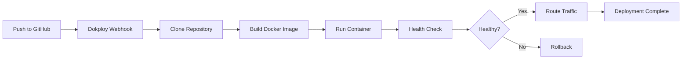
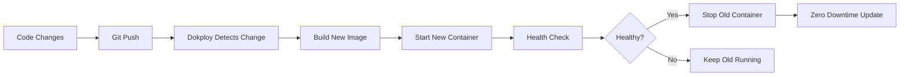

# Dash Dashboard - Production Deployment Architecture

**Version:** 1.0.0  
**Last Updated:** 2025-01-09  
**Application Type:** Dash Analytics Dashboard (Public, No Authentication)  
**Target Platform:** Dokploy  
**Database:** SQLite (existing)

---

## Executive Summary

### Purpose

Streamlined production deployment architecture for the existing **Management Tools Analysis Dashboard** (Dash application) to Dokploy platform. This is a **public research dashboard** with no user authentication requirements.

### Key Objectives

- ✅ Containerize existing Dash application
- ✅ Add production-grade health checks for Dokploy
- ✅ Optimize Docker build for fast deployments
- ✅ Add basic security headers (CORS, CSP for Dash/Plotly)
- ✅ Configure Gunicorn for production serving
- ✅ Simple logging and monitoring
- ✅ Preserve existing SQLite databases

### What We're NOT Building

- ❌ User authentication system
- ❌ PostgreSQL database (using existing SQLite)
- ❌ Complex API with CRUD operations
- ❌ User management
- ❌ Redis caching (optional, not required)
- ❌ Nginx (Dokploy handles reverse proxy)

---

## System Architecture

### Simplified Architecture

```
┌─────────────────────────────────────────────┐
│              Internet/Users                  │
└──────────────────┬──────────────────────────┘
                   │
                   ▼
┌─────────────────────────────────────────────┐
│          Dokploy Platform                    │
│  ┌────────────────────────────────────────┐ │
│  │  - SSL Termination                     │ │
│  │  - Reverse Proxy                       │ │
│  │  - Domain Management                   │ │
│  │  - Health Check Monitoring             │ │
│  └────────────────────────────────────────┘ │
└──────────────────┬──────────────────────────┘
                   │
                   ▼
┌─────────────────────────────────────────────┐
│         Docker Container                     │
│  ┌────────────────────────────────────────┐ │
│  │  Dash App (Gunicorn)                   │ │
│  │  Port: 8050                            │ │
│  │  ├─ /health (health check)             │ │
│  │  ├─ / (dashboard)                      │ │
│  │  └─ /assets/* (static files)           │ │
│  └────────────────────────────────────────┘ │
│  ┌────────────────────────────────────────┐ │
│  │  SQLite Databases (Volume)             │ │
│  │  ├─ data.db                            │ │
│  │  └─ notes_and_doi.db                   │ │
│  └────────────────────────────────────────┘ │
└─────────────────────────────────────────────┘
```

### Request Flow

```
1. User Browser
   ↓
2. Dokploy (SSL, Domain, Proxy)
   ↓
3. Docker Container
   ├─→ Gunicorn (WSGI Server)
   ├─→ Dash Application
   ├─→ SQLite Database
   └─→ Static Assets
   ↓
4. Response (HTML/JS/JSON)
   ↓
5. User Browser
```

---

## Technology Stack

### Core Application

| Component    | Version | Purpose              |
| ------------ | ------- | -------------------- |
| Python       | 3.11+   | Runtime              |
| Dash         | 3.2.0   | Web framework        |
| Plotly       | 6.3.1   | Visualizations       |
| Pandas       | 2.3.3   | Data processing      |
| NumPy        | 2.3.3   | Numerical computing  |
| SciPy        | 1.16.2  | Scientific computing |
| scikit-learn | 1.7.2   | Machine learning     |
| statsmodels  | 0.14.5  | Statistical models   |

### Production Server

| Component | Version | Purpose                  |
| --------- | ------- | ------------------------ |
| Gunicorn  | 21.2.0  | WSGI server              |
| Gevent    | 23.9.1  | Async workers (optional) |

### Infrastructure

| Component | Version | Purpose             |
| --------- | ------- | ------------------- |
| Docker    | 24.0+   | Containerization    |
| Dokploy   | Latest  | Deployment platform |

### Optional Enhancements

| Component     | Version  | Purpose               |
| ------------- | -------- | --------------------- |
| Redis         | 7-alpine | Caching (if needed)   |
| python-dotenv | 1.0.0    | Environment variables |
| Flask-CORS    | 4.0.0    | CORS handling         |

---

## Minimal Project Structure

```
Management-Tools-Analysis/           # Your existing repo
│
├── dashboard_app/                   # Your existing Dash app
│   ├── app.py                      # Main Dash application (EXISTS)
│   ├── tools.py                    # Tool definitions (EXISTS)
│   ├── database.py                 # Database manager (EXISTS)
│   ├── fix_source_mapping.py       # Source mapping (EXISTS)
│   ├── data.db                     # SQLite database (EXISTS)
│   ├── notes_and_doi.db           # Notes database (EXISTS)
│   ├── requirements.txt            # Dependencies (EXISTS)
│   └── pyproject.toml             # UV config (EXISTS)
│
├── assets/                         # Static assets (EXISTS)
│   ├── *.png
│   └── *.svg
│
├── Dockerfile                      # NEW - Container build
├── docker-compose.yml             # NEW - Local testing (optional)
├── .dockerignore                  # NEW - Build optimization
├── .env.example                   # NEW - Environment template
├── gunicorn.conf.py              # NEW - Production server config
├── healthcheck.sh                # NEW - Health check script
├── entrypoint.sh                 # NEW - Container startup
├── DEPLOYMENT.md                 # NEW - Deployment guide
└── README.md                     # UPDATE - Add deployment info
```

---

## Component Specifications

### 1. Dockerfile (Multi-Stage Build)

**Purpose:** Containerize Dash app with optimized layers

```dockerfile
# Stage 1: Builder - compile dependencies
FROM python:3.11-slim as builder

WORKDIR /build

# Install build dependencies
RUN apt-get update && \
    apt-get install -y --no-install-recommends \
    build-essential \
    && rm -rf /var/lib/apt/lists/*

# Copy requirements
COPY dashboard_app/requirements.txt .

# Build wheels for faster installation
RUN pip wheel --no-cache-dir --wheel-dir /wheels -r requirements.txt

# Stage 2: Runtime - minimal production image
FROM python:3.11-slim

# Install runtime dependencies only
RUN apt-get update && \
    apt-get install -y --no-install-recommends \
    curl \
    && rm -rf /var/lib/apt/lists/*

# Create non-root user
RUN useradd -m -u 1000 dashuser

# Set working directory
WORKDIR /app

# Copy wheels from builder
COPY --from=builder /wheels /wheels

# Install dependencies from wheels
RUN pip install --no-cache-dir /wheels/* && \
    rm -rf /wheels

# Copy application code
COPY --chown=dashuser:dashuser dashboard_app/ ./dashboard_app/
COPY --chown=dashuser:dashuser assets/ ./assets/
COPY --chown=dashuser:dashuser database.py ./
COPY --chown=dashuser:dashuser tools.py ./
COPY --chown=dashuser:dashuser gunicorn.conf.py ./
COPY --chown=dashuser:dashuser healthcheck.sh ./
COPY --chown=dashuser:dashuser entrypoint.sh ./

# Make scripts executable
RUN chmod +x healthcheck.sh entrypoint.sh

# Switch to non-root user
USER dashuser

# Expose port
EXPOSE 8050

# Health check
HEALTHCHECK --interval=30s --timeout=10s --start-period=40s --retries=3 \
    CMD ./healthcheck.sh

# Use entrypoint script
ENTRYPOINT ["./entrypoint.sh"]

# Default command
CMD ["gunicorn", "-c", "gunicorn.conf.py", "dashboard_app.app:server"]
```

### 2. Gunicorn Configuration

**Purpose:** Production WSGI server configuration for Dash

```python
# gunicorn.conf.py
import multiprocessing
import os

# Server socket
bind = f"0.0.0.0:{os.getenv('PORT', '8050')}"
backlog = 2048

# Worker processes
workers = int(os.getenv('MAX_WORKERS', multiprocessing.cpu_count() * 2 + 1))
worker_class = "sync"  # Use sync for Dash (gevent can cause issues)
timeout = int(os.getenv('WORKER_TIMEOUT', '120'))
keepalive = 5

# Worker recycling (prevent memory leaks)
max_requests = 1000
max_requests_jitter = 100

# Logging
accesslog = "-"  # stdout
errorlog = "-"   # stderr
loglevel = os.getenv('LOG_LEVEL', 'info').lower()

# Access log format
access_log_format = '%(h)s %(l)s %(u)s %(t)s "%(r)s" %(s)s %(b)s "%(f)s" "%(a)s" %(D)s'

# Process naming
proc_name = "dash_app"

# Server mechanics
daemon = False
pidfile = None
preload_app = True  # Load app before forking workers

# Graceful timeout
graceful_timeout = 30

# For Dash compatibility
forwarded_allow_ips = '*'
```

### 3. Health Check Script

**Purpose:** Simple health check for Dokploy monitoring

```bash
#!/bin/sh
# healthcheck.sh

# Check if app is responding
curl -f http://localhost:8050/health || exit 1

# Optional: Check if database files exist
if [ ! -f "/app/dashboard_app/data.db" ]; then
    echo "Database file not found"
    exit 1
fi

exit 0
```

### 4. Entrypoint Script

**Purpose:** Container initialization and startup

```bash
#!/bin/bash
# entrypoint.sh

set -e

echo "Starting Dash Dashboard..."

# Check if database files exist
if [ ! -f "/app/dashboard_app/data.db" ]; then
    echo "WARNING: data.db not found"
fi

if [ ! -f "/app/dashboard_app/notes_and_doi.db" ]; then
    echo "WARNING: notes_and_doi.db not found"
fi

# Create logs directory if it doesn't exist
mkdir -p /app/logs

# Execute the command passed to the container
exec "$@"
```

### 5. Modified app.py (Add Health Endpoint)

**Purpose:** Add `/health` endpoint to existing Dash app

```python
# Add to dashboard_app/app.py

# Get the underlying Flask server
server = app.server

# Add health check endpoint
@server.route('/health')
def health_check():
    """Health check endpoint for Dokploy"""
    import json
    from datetime import datetime

    health_status = {
        'status': 'healthy',
        'timestamp': datetime.utcnow().isoformat() + 'Z',
        'version': '1.0.0',
        'service': 'management-tools-dashboard',
        'database': 'connected' if db_manager else 'unavailable'
    }

    return json.dumps(health_status), 200, {'Content-Type': 'application/json'}

# Update the main block
if __name__ == '__main__':
    app.run(
        debug=False,  # Set to False for production
        host='0.0.0.0',
        port=int(os.getenv('PORT', 8050))
    )
```

### 6. Environment Variables (.env.example)

```bash
# .env.example

# Application Settings
PORT=8050
FLASK_ENV=production
LOG_LEVEL=INFO

# Gunicorn Settings
MAX_WORKERS=4
WORKER_TIMEOUT=120

# Optional: If you add Redis caching later
# REDIS_URL=redis://redis:6379/0

# Application Version
APP_VERSION=1.0.0
```

### 7. .dockerignore

```
# Python
__pycache__/
*.py[cod]
*.so
.Python

# Virtual environments
venv/
.venv/
env/
ENV/

# IDE
.vscode/
.idea/
*.swp
*.swo

# Git
.git/
.gitignore
.gitattributes

# Documentation (except README)
*.md
!README.md
!DEPLOYMENT.md

# Tests
tests/
.pytest_cache/
.coverage
htmlcov/

# Logs
*.log
logs/

# OS
.DS_Store
Thumbs.db

# Data files (keep databases in image or use volumes)
# Uncomment if databases should be external
# *.db

# Large data directories
dbase-non-indexed/
crData/
rawData/
output/
visualizations/
Informes/

# Development files
.env
.env.local
todo.md
```

### 8. Docker Compose (Optional - for local testing)

```yaml
version: "3.8"

services:
  dash:
    build:
      context: .
      dockerfile: Dockerfile
    ports:
      - "8050:8050"
    environment:
      - PORT=8050
      - FLASK_ENV=production
      - LOG_LEVEL=INFO
    volumes:
      # Mount databases as volumes for persistence
      - ./dashboard_app/data.db:/app/dashboard_app/data.db
      - ./dashboard_app/notes_and_doi.db:/app/dashboard_app/notes_and_doi.db
      # Mount assets for development
      - ./assets:/app/assets:ro
    healthcheck:
      test: ["CMD", "./healthcheck.sh"]
      interval: 30s
      timeout: 10s
      retries: 3
      start_period: 40s
    restart: unless-stopped

# Optional: Add Redis if you want caching
#  redis:
#    image: redis:7-alpine
#    volumes:
#      - redis_data:/data
#    healthcheck:
#      test: ["CMD", "redis-cli", "ping"]
#      interval: 10s
#      timeout: 5s
#      retries: 5

volumes:
  # Optional Redis volume
  # redis_data:
```

---

## Deployment to Dokploy

### Prerequisites

1. GitHub repository with your code
2. Dokploy account
3. Domain name (optional, Dokploy provides subdomain)

### Dokploy Configuration

#### 1. Create New Application

- **Type:** Docker
- **Source:** GitHub Repository
- **Branch:** main
- **Build Method:** Dockerfile

#### 2. Build Settings

```
Build Context: .
Dockerfile Path: ./Dockerfile
Port: 8050
```

#### 3. Environment Variables

```
PORT=8050
FLASK_ENV=production
LOG_LEVEL=INFO
MAX_WORKERS=4
WORKER_TIMEOUT=120
APP_VERSION=1.0.0
```

#### 4. Health Check

```
Path: /health
Port: 8050
Interval: 30s
Timeout: 10s
Retries: 3
```

#### 5. Domain & SSL

- Dokploy auto-configures SSL with Let's Encrypt
- Set custom domain or use provided subdomain

#### 6. Volumes (if databases external)

```
Source: ./dashboard_app/data.db
Target: /app/dashboard_app/data.db

Source: ./dashboard_app/notes_and_doi.db
Target: /app/dashboard_app/notes_and_doi.db
```

### GitHub Integration

#### Automatic Deployment

1. Connect GitHub repository to Dokploy
2. Enable webhook for automatic deployments
3. Push to main branch triggers deployment

#### Manual Deployment

1. Use Dokploy UI to trigger deployment
2. Monitor build logs
3. Check health status

---

## Security Considerations

### 1. Basic Security Headers

Add to `dashboard_app/app.py`:

```python
@server.after_request
def add_security_headers(response):
    """Add basic security headers"""
    # CORS - allow all origins for public dashboard
    response.headers['Access-Control-Allow-Origin'] = '*'

    # CSP - allow Dash/Plotly CDNs
    response.headers['Content-Security-Policy'] = (
        "default-src 'self'; "
        "script-src 'self' 'unsafe-inline' 'unsafe-eval' https://cdn.plot.ly https://cdnjs.cloudflare.com; "
        "style-src 'self' 'unsafe-inline' https://cdnjs.cloudflare.com; "
        "img-src 'self' data: https:; "
        "font-src 'self' data: https://cdnjs.cloudflare.com; "
        "connect-src 'self';"
    )

    # Basic security headers
    response.headers['X-Content-Type-Options'] = 'nosniff'
    response.headers['X-Frame-Options'] = 'SAMEORIGIN'  # Allow embedding if needed

    return response
```

### 2. Rate Limiting (Optional)

If you experience abuse, add Flask-Limiter:

```python
from flask_limiter import Limiter
from flask_limiter.util import get_remote_address

limiter = Limiter(
    app=server,
    key_func=get_remote_address,
    default_limits=["200 per hour"],
    storage_uri="memory://"  # Or redis:// if using Redis
)
```

---

## Performance Optimization

### 1. Existing Optimizations (Keep These)

- ✅ In-memory caching (`_processed_data_cache`)
- ✅ Lazy loading for complex analyses
- ✅ Data downsampling for large datasets
- ✅ Efficient Plotly rendering

### 2. Docker Optimizations

- Multi-stage build (smaller image)
- Layer caching (faster rebuilds)
- Wheel-based installation (faster deployment)
- Non-root user (security)

### 3. Gunicorn Optimizations

- Multiple workers (CPU cores \* 2 + 1)
- Worker recycling (prevent memory leaks)
- Preload app (faster startup)
- Timeout configuration

---

## Monitoring & Logging

### 1. Simple Logging

Add to `dashboard_app/app.py`:

```python
import logging
from logging.handlers import RotatingFileHandler
import os

# Configure logging
if not os.path.exists('logs'):
    os.mkdir('logs')

file_handler = RotatingFileHandler(
    'logs/dashboard.log',
    maxBytes=10240000,  # 10MB
    backupCount=10
)

file_handler.setFormatter(logging.Formatter(
    '%(asctime)s %(levelname)s: %(message)s [in %(pathname)s:%(lineno)d]'
))

file_handler.setLevel(logging.INFO)
server.logger.addHandler(file_handler)
server.logger.setLevel(logging.INFO)
server.logger.info('Dashboard startup')
```

### 2. Health Check Monitoring

Dokploy automatically monitors `/health` endpoint:

- Green: Application healthy
- Yellow: Degraded performance
- Red: Application down

### 3. Application Logs

View logs in Dokploy UI:

- Real-time log streaming
- Historical log search
- Download logs

---

## Database Strategy

### Current Setup (SQLite)

- ✅ **data.db** - Main application data
- ✅ **notes_and_doi.db** - Notes and DOI information
- ✅ Read-only in production (no writes)
- ✅ Included in Docker image OR mounted as volume

### Options for Database Handling

#### Option A: Include in Docker Image (Recommended for read-only)

```dockerfile
# In Dockerfile
COPY --chown=dashuser:dashuser dashboard_app/*.db ./dashboard_app/
```

**Pros:**

- Simple deployment
- Fast access
- No external dependencies

**Cons:**

- Database updates require rebuild
- Not suitable for write operations

#### Option B: Mount as Volume (For updates)

```yaml
# In docker-compose.yml or Dokploy volume config
volumes:
  - ./dashboard_app/data.db:/app/dashboard_app/data.db
  - ./dashboard_app/notes_and_doi.db:/app/dashboard_app/notes_and_doi.db
```

**Pros:**

- Can update databases without rebuild
- Persistent across deployments

**Cons:**

- Requires volume management
- Slightly more complex setup

---

## Deployment Workflow

### Initial Deployment



### Update Deployment



---

## File Specifications

### 1. requirements.txt (Production)

```txt
# Core Dash
dash==3.2.0
dash-bootstrap-components==2.0.4

# Data Processing
pandas==2.3.3
numpy==2.3.3

# Visualization
plotly==6.3.1

# Scientific Computing
scipy==1.16.2
scikit-learn==1.7.2
statsmodels==0.14.5

# Production Server
gunicorn==21.2.0

# Optional: Environment & CORS
python-dotenv==1.0.0
Flask-CORS==4.0.0

# Optional: Caching
# redis==5.0.1
# Flask-Limiter==3.5.0
```

### 2. .gitignore Updates

```
# Add to existing .gitignore

# Docker
.dockerignore

# Environment
.env
.env.local
.env.production

# Logs
logs/
*.log

# Build artifacts
dist/
build/
```

### 3. DEPLOYMENT.md

````markdown
# Deployment Guide

## Quick Start

### 1. Prepare Repository

```bash
git clone https://github.com/Wise-Connex/Management-Tools-Analysis.git
cd Management-Tools-Analysis
```
````

### 2. Test Locally with Docker

```bash
# Build image
docker build -t dash-dashboard .

# Run container
docker run -p 8050:8050 dash-dashboard

# Test health check
curl http://localhost:8050/health
```

### 3. Deploy to Dokploy

1. **Create Application:**

   - Go to Dokploy dashboard
   - Click "New Application"
   - Select "Docker" type

2. **Configure Source:**

   - Repository: `https://github.com/Wise-Connex/Management-Tools-Analysis`
   - Branch: `main`
   - Dockerfile: `./Dockerfile`

3. **Set Environment:**

   ```
   PORT=8050
   FLASK_ENV=production
   LOG_LEVEL=INFO
   MAX_WORKERS=4
   ```

4. **Configure Health Check:**

   - Path: `/health`
   - Port: `8050`
   - Interval: `30s`

5. **Deploy:**
   - Click "Deploy"
   - Monitor build logs
   - Wait for health check to pass

### 4. Verify Deployment

```bash
# Check health
curl https://your-domain.com/health

# Access dashboard
open https://your-domain.com
```

## Troubleshooting

### Container won't start

- Check logs in Dokploy UI
- Verify database files exist
- Check port configuration

### Health check failing

- Ensure port 8050 is exposed
- Verify `/health` endpoint responds
- Check application logs

### Database errors

- Verify database files are included/mounted
- Check file permissions
- Ensure SQLite is accessible

## Rollback

If deployment fails:

1. Go to Dokploy UI
2. Select previous deployment
3. Click "Rollback"
4. Verify health check passes

````

---

## Comparison: Before vs After

### Before (Development)
```bash
cd dashboard_app
python app.py
# Runs on http://localhost:8050
````

### After (Production)

```bash
# Dokploy handles everything:
# - SSL certificate
# - Domain routing
# - Health monitoring
# - Auto-restart on failure
# - Zero-downtime updates

# Access at: https://your-domain.com
```

---

## Cost & Resource Estimates

### Docker Image Size

- **Before optimization:** ~2GB
- **After multi-stage build:** ~800MB
- **Savings:** 60% reduction

### Memory Usage

- **Base:** ~200MB
- **Per worker:** ~150MB
- **Total (4 workers):** ~800MB
- **Recommended:** 1GB RAM minimum

### CPU Usage

- **Idle:** <5%
- **Active queries:** 20-40%
- **Recommended:** 1 vCPU minimum

---

## Next Steps

### Phase 1: Minimal Deployment (Recommended)

1. Create `Dockerfile`
2. Create `gunicorn.conf.py`
3. Create `healthcheck.sh`
4. Create `entrypoint.sh`
5. Add `/health` endpoint to `app.py`
6. Create `.dockerignore`
7. Create `.env.example`
8. Test locally with Docker
9. Deploy to Dokploy

### Phase 2: Enhancements (Optional)

1. Add Redis caching
2. Add rate limiting
3. Add Prometheus metrics
4. Add CI/CD pipeline
5. Add automated backups

---

## Appendix

### Dokploy Features We Use

- ✅ GitHub integration
- ✅ Automatic SSL (Let's Encrypt)
- ✅ Health check monitoring
- ✅ Zero-downtime deployments
- ✅ Environment variable management
- ✅ Log aggregation
- ✅ Domain management

### Dokploy Features We DON'T Need

- ❌ Database service (using SQLite in container)
- ❌ Redis service (optional)
- ❌ Custom nginx config (Dokploy handles proxy)
- ❌ Load balancer (single instance sufficient)

---

## Version History

| Version | Date       | Changes                                     |
| ------- | ---------- | ------------------------------------------- |
| 1.0.0   | 2025-01-09 | Simplified architecture for Dash deployment |

---

**Document Status:** ✅ Ready for Implementation  
**Complexity:** Low (8 new files)  
**Estimated Time:** 2-3 hours  
**Next Step:** Create Dockerfile and supporting files
