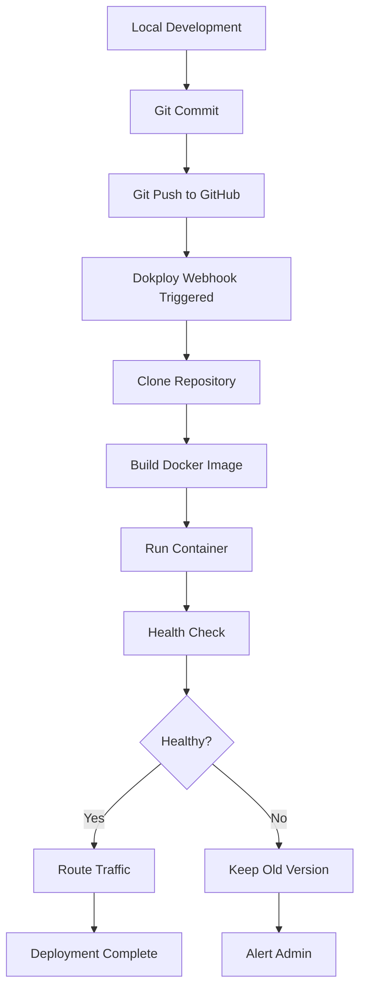

# Deployment Guide - Management Tools Analysis Dashboard

**Application:** Dash Analytics Dashboard  
**Platform:** Dokploy  
**Version:** 1.0.0  
**Last Updated:** 2025-01-09

---

## Table of Contents

1. [Quick Start](#quick-start)
2. [Local Development](#local-development)
3. [Docker Testing](#docker-testing)
4. [Dokploy Deployment](#dokploy-deployment)
5. [Environment Configuration](#environment-configuration)
6. [Troubleshooting](#troubleshooting)
7. [Monitoring & Maintenance](#monitoring--maintenance)

---

## Quick Start

### Prerequisites

- ✅ Git installed
- ✅ Docker installed (for local testing)
- ✅ Dokploy account
- ✅ GitHub repository access

### 5-Minute Deployment to Dokploy

```bash
# 1. Ensure your code is pushed to GitHub
git add .
git commit -m "Add production deployment files"
git push origin main

# 2. Go to Dokploy dashboard
# 3. Click "New Application" → "Docker"
# 4. Connect GitHub repository
# 5. Configure and deploy (see detailed steps below)
```

---

## Local Development

### Setup Without Docker

```bash
# 1. Clone repository
git clone https://github.com/Wise-Connex/Management-Tools-Analysis.git
cd Management-Tools-Analysis

# 2. Create virtual environment (using UV as per project rules)
uv venv
source .venv/bin/activate  # On Windows: .venv\Scripts\activate

# 3. Install dependencies
cd dashboard_app
uv pip install -r requirements.txt

# 4. Run development server
python app.py

# 5. Access dashboard
open http://localhost:8050
```

### Verify Health Endpoint

```bash
# Test health check
curl http://localhost:8050/health

# Expected response:
# {
#   "status": "healthy",
#   "timestamp": "2025-01-09T16:00:00Z",
#   "version": "1.0.0",
#   "service": "management-tools-dashboard",
#   "database": "connected",
#   "cache_size": 0,
#   "environment": "development"
# }
```

---

## Docker Testing

### Build and Run Locally

```bash
# 1. Build Docker image
docker build -t dash-dashboard:latest .

# 2. Run container
docker run -d \
  --name dash-dashboard \
  -p 8050:8050 \
  -e FLASK_ENV=production \
  -e LOG_LEVEL=INFO \
  dash-dashboard:latest

# 3. Check logs
docker logs -f dash-dashboard

# 4. Test health check
curl http://localhost:8050/health

# 5. Access dashboard
open http://localhost:8050

# 6. Stop container
docker stop dash-dashboard
docker rm dash-dashboard
```

### Using Docker Compose

```bash
# 1. Start all services
docker-compose up -d

# 2. View logs
docker-compose logs -f dash

# 3. Check health
curl http://localhost:8050/health

# 4. Access dashboard
open http://localhost:8050

# 5. Stop services
docker-compose down

# 6. Clean up (including volumes)
docker-compose down -v
```

### Verify Build Optimization

```bash
# Check image size
docker images dash-dashboard

# Expected size: ~800MB (optimized with multi-stage build)

# Inspect image layers
docker history dash-dashboard:latest

# Check running container resources
docker stats dash-dashboard
```

---

## Dokploy Deployment

### Step 1: Prepare Repository

```bash
# Ensure all deployment files are committed
git status

# Required files:
# ✅ Dockerfile
# ✅ gunicorn.conf.py
# ✅ healthcheck.sh
# ✅ entrypoint.sh
# ✅ .dockerignore
# ✅ .env.example
# ✅ docker-compose.yml (optional)
# ✅ dashboard_app/app.py (with /health endpoint)

# Push to GitHub
git add .
git commit -m "Add Dokploy deployment configuration"
git push origin main
```

### Step 2: Create Dokploy Application

1. **Login to Dokploy Dashboard**

   - Go to your Dokploy instance
   - Navigate to Projects

2. **Create New Application**

   - Click "New Application"
   - Select "Docker" as application type
   - Name: `management-tools-dashboard`

3. **Connect GitHub Repository**
   - Repository: `https://github.com/Wise-Connex/Management-Tools-Analysis`
   - Branch: `main`
   - Auto-deploy: ✅ Enable (deploy on push)

### Step 3: Configure Build Settings

```yaml
Build Configuration:
  Build Context: .
  Dockerfile Path: ./Dockerfile
  Build Arguments: (none required)
```

### Step 4: Set Environment Variables

In Dokploy UI, add these environment variables:

```bash
# Required
PORT=8050
FLASK_ENV=production
LOG_LEVEL=INFO

# Optional
APP_VERSION=1.0.0
MAX_WORKERS=4
WORKER_TIMEOUT=120
WORKER_CLASS=sync
```

### Step 5: Configure Health Check

```yaml
Health Check Configuration:
  Protocol: HTTP
  Path: /health
  Port: 8050
  Interval: 30s
  Timeout: 10s
  Retries: 3
  Start Period: 40s
```

### Step 6: Configure Domain & SSL

```yaml
Domain Configuration:
  Domain: dashboard.yourdomain.com
  SSL: Auto (Let's Encrypt)
  Force HTTPS: Yes

# Or use Dokploy subdomain:
  Subdomain: management-tools
  Domain: your-instance.dokploy.com
```

### Step 7: Deploy

1. Click "Deploy" button
2. Monitor build logs in real-time
3. Wait for health check to pass (green status)
4. Access your dashboard at configured domain

### Step 8: Verify Deployment

```bash
# Check health endpoint
curl https://your-domain.com/health

# Expected response:
# {
#   "status": "healthy",
#   "timestamp": "2025-01-09T16:00:00Z",
#   "version": "1.0.0",
#   "service": "management-tools-dashboard",
#   "database": "connected"
# }

# Access dashboard
open https://your-domain.com
```

---

## Environment Configuration

### Environment Variables Reference

| Variable         | Required | Default    | Description                              |
| ---------------- | -------- | ---------- | ---------------------------------------- |
| `PORT`           | No       | 8050       | Application port                         |
| `FLASK_ENV`      | No       | production | Environment (development/production)     |
| `LOG_LEVEL`      | No       | INFO       | Logging level (DEBUG/INFO/WARNING/ERROR) |
| `APP_VERSION`    | No       | 1.0.0      | Application version for tracking         |
| `MAX_WORKERS`    | No       | auto       | Gunicorn worker count (CPU \* 2 + 1)     |
| `WORKER_TIMEOUT` | No       | 120        | Worker timeout in seconds                |
| `WORKER_CLASS`   | No       | sync       | Worker class (sync/gevent)               |

### Setting Environment Variables in Dokploy

1. Go to Application Settings
2. Navigate to "Environment Variables" tab
3. Click "Add Variable"
4. Enter key and value
5. Click "Save"
6. Redeploy application

---

## Troubleshooting

### Build Failures

#### Issue: "No such file or directory"

```bash
# Check .dockerignore - ensure required files aren't excluded
cat .dockerignore

# Verify files exist in repository
ls -la dashboard_app/
ls -la assets/
```

#### Issue: "pip install failed"

```bash
# Check requirements.txt is valid
cat dashboard_app/requirements.txt

# Test locally
pip install -r dashboard_app/requirements.txt
```

### Runtime Failures

#### Issue: Health check failing

```bash
# Check container logs in Dokploy UI
# Or locally:
docker logs dash-dashboard

# Test health endpoint manually
docker exec dash-dashboard curl http://localhost:8050/health
```

#### Issue: Database not found

```bash
# Verify database files are in image
docker exec dash-dashboard ls -la /app/dashboard_app/

# Check if databases are mounted correctly
docker inspect dash-dashboard | grep Mounts
```

#### Issue: Port already in use

```bash
# Change PORT environment variable in Dokploy
PORT=8051

# Or stop conflicting service
docker ps
docker stop <conflicting-container>
```

### Performance Issues

#### Issue: Slow response times

```bash
# Increase worker count
MAX_WORKERS=8

# Increase worker timeout
WORKER_TIMEOUT=180

# Check resource limits in Dokploy
# Increase CPU/Memory allocation
```

#### Issue: Out of memory

```bash
# Reduce worker count
MAX_WORKERS=2

# Check memory usage
docker stats dash-dashboard

# Increase container memory limit in Dokploy
```

---

## Monitoring & Maintenance

### Viewing Logs

#### In Dokploy UI

1. Go to Application
2. Click "Logs" tab
3. View real-time logs
4. Filter by level (INFO, WARNING, ERROR)
5. Download logs for analysis

#### Using Docker CLI

```bash
# View logs
docker-compose logs -f dash

# Last 100 lines
docker-compose logs --tail=100 dash

# Follow logs with timestamps
docker-compose logs -f -t dash
```

### Health Monitoring

#### Automated Monitoring

- Dokploy automatically monitors `/health` endpoint
- Green: Healthy
- Yellow: Degraded
- Red: Unhealthy (triggers restart)

#### Manual Health Check

```bash
# Check health
curl https://your-domain.com/health | jq

# Check response time
time curl https://your-domain.com/health
```

### Application Metrics

Access the performance monitoring section in the dashboard:

- Navigate to bottom of page
- View "Monitor de Rendimiento del Sistema"
- Check database stats, cache stats, query performance

### Updating the Application

#### Automatic Updates (Recommended)

```bash
# 1. Make changes locally
# 2. Commit and push to GitHub
git add .
git commit -m "Update dashboard features"
git push origin main

# 3. Dokploy automatically detects push and deploys
# 4. Monitor deployment in Dokploy UI
# 5. Verify health check passes
```

#### Manual Deployment

1. Go to Dokploy UI
2. Select application
3. Click "Deploy" button
4. Monitor build progress
5. Wait for health check

### Rollback Procedure

If deployment fails or introduces issues:

1. **In Dokploy UI:**

   - Go to "Deployments" tab
   - Find previous successful deployment
   - Click "Rollback"
   - Confirm rollback

2. **Using Git:**

   ```bash
   # Revert to previous commit
   git log --oneline
   git revert <commit-hash>
   git push origin main

   # Dokploy will auto-deploy the reverted version
   ```

### Backup Strategy

#### Database Backups

```bash
# Copy databases from container
docker cp dash-dashboard:/app/dashboard_app/data.db ./backups/data_$(date +%Y%m%d).db
docker cp dash-dashboard:/app/dashboard_app/notes_and_doi.db ./backups/notes_$(date +%Y%m%d).db

# Automated backup script (add to cron)
#!/bin/bash
BACKUP_DIR="./backups"
DATE=$(date +%Y%m%d_%H%M%S)
docker cp dash-dashboard:/app/dashboard_app/data.db $BACKUP_DIR/data_$DATE.db
docker cp dash-dashboard:/app/dashboard_app/notes_and_doi.db $BACKUP_DIR/notes_$DATE.db
```

---

## Advanced Configuration

### Custom Domain Setup

1. **Add DNS Record:**

   ```
   Type: A
   Name: dashboard (or @)
   Value: <Dokploy-IP>
   TTL: 3600
   ```

2. **Configure in Dokploy:**

   - Go to Application Settings
   - Domain tab
   - Add custom domain
   - Enable SSL (Let's Encrypt)

3. **Verify:**
   ```bash
   curl https://dashboard.yourdomain.com/health
   ```

### SSL Certificate

Dokploy automatically provisions SSL certificates using Let's Encrypt:

- ✅ Auto-renewal every 90 days
- ✅ HTTPS redirect enabled
- ✅ HSTS headers added

### Resource Scaling

#### Vertical Scaling (More Resources)

1. Go to Dokploy Application Settings
2. Resources tab
3. Increase CPU/Memory limits
4. Redeploy

#### Horizontal Scaling (More Instances)

1. Increase `MAX_WORKERS` environment variable
2. Or deploy multiple instances with load balancer

---

## Testing Checklist

Before deploying to production, verify:

- [ ] Health endpoint responds: `curl http://localhost:8050/health`
- [ ] Dashboard loads: `open http://localhost:8050`
- [ ] Can select management tool
- [ ] Can select data sources
- [ ] Graphs render correctly
- [ ] Database queries work
- [ ] No console errors
- [ ] Mobile responsive
- [ ] Assets load (images, fonts)
- [ ] Performance acceptable (<2s load time)

---

## Production Deployment Checklist

- [ ] All code committed and pushed to GitHub
- [ ] Dockerfile tested locally
- [ ] Health check passes
- [ ] Environment variables configured in Dokploy
- [ ] Domain/SSL configured
- [ ] Health check configured in Dokploy
- [ ] Auto-deploy enabled
- [ ] Backup strategy in place
- [ ] Monitoring configured
- [ ] Documentation updated

---

## Useful Commands

### Docker Commands

```bash
# Build image
docker build -t dash-dashboard .

# Run container
docker run -p 8050:8050 dash-dashboard

# Execute command in container
docker exec -it dash-dashboard /bin/bash

# View logs
docker logs -f dash-dashboard

# Check health
docker exec dash-dashboard ./healthcheck.sh

# Inspect container
docker inspect dash-dashboard

# Remove container
docker rm -f dash-dashboard

# Remove image
docker rmi dash-dashboard
```

### Docker Compose Commands

```bash
# Start services
docker-compose up -d

# Stop services
docker-compose down

# Rebuild and start
docker-compose up -d --build

# View logs
docker-compose logs -f

# Execute command
docker-compose exec dash python --version

# Restart service
docker-compose restart dash

# Scale service (if configured)
docker-compose up -d --scale dash=3
```

### Debugging Commands

```bash
# Check if port is in use
lsof -i :8050

# Test health endpoint
curl -v http://localhost:8050/health

# Check container resources
docker stats dash-dashboard

# Inspect network
docker network inspect dash_network

# Check file permissions
docker exec dash-dashboard ls -la /app/dashboard_app/
```

---

## Deployment Scenarios

### Scenario 1: First-Time Deployment

```bash
# 1. Prepare repository
git clone <repo-url>
cd Management-Tools-Analysis

# 2. Test locally with Docker
docker build -t dash-dashboard .
docker run -p 8050:8050 dash-dashboard

# 3. Verify health
curl http://localhost:8050/health

# 4. Push to GitHub
git push origin main

# 5. Deploy in Dokploy
# Follow "Dokploy Deployment" section above
```

### Scenario 2: Update Existing Deployment

```bash
# 1. Make changes
# Edit files as needed

# 2. Test locally
docker-compose up --build

# 3. Commit and push
git add .
git commit -m "Update: description of changes"
git push origin main

# 4. Dokploy auto-deploys
# Monitor in Dokploy UI

# 5. Verify deployment
curl https://your-domain.com/health
```

### Scenario 3: Rollback After Failed Deployment

```bash
# Option A: Rollback in Dokploy UI
# 1. Go to Deployments tab
# 2. Select previous successful deployment
# 3. Click "Rollback"

# Option B: Git revert
git revert HEAD
git push origin main
# Dokploy auto-deploys reverted version
```

---

## Performance Optimization

### Image Size Optimization

Current optimizations:

- ✅ Multi-stage build (reduces size by 60%)
- ✅ Wheel-based installation (faster deployment)
- ✅ Minimal base image (python:3.11-slim)
- ✅ Layer caching (faster rebuilds)

Expected sizes:

- **Development:** ~2GB
- **Production:** ~800MB

### Runtime Optimization

```bash
# Adjust worker count based on CPU
MAX_WORKERS=4  # For 2 CPU cores

# Increase timeout for complex queries
WORKER_TIMEOUT=180

# Use sync workers for Dash (most reliable)
WORKER_CLASS=sync
```

### Database Optimization

The application already includes:

- ✅ In-memory caching (`_processed_data_cache`)
- ✅ Lazy loading for complex analyses
- ✅ Data downsampling for large datasets
- ✅ Efficient Plotly rendering

---

## Security Considerations

### Current Security Features

- ✅ Non-root user in container (dashuser)
- ✅ Security headers (CSP, X-Frame-Options, etc.)
- ✅ CORS configured for public access
- ✅ Health check endpoint (no sensitive data)
- ✅ Read-only database (no write operations)

### Additional Security (Optional)

#### Add Rate Limiting

```python
# Install Flask-Limiter
pip install Flask-Limiter

# Add to app.py
from flask_limiter import Limiter
from flask_limiter.util import get_remote_address

limiter = Limiter(
    app=server,
    key_func=get_remote_address,
    default_limits=["200 per hour"],
    storage_uri="memory://"
)
```

#### Restrict Access by IP

In Dokploy or nginx:

```nginx
# Allow specific IPs only
allow 1.2.3.4;
deny all;
```

---

## Monitoring

### Built-in Monitoring

The dashboard includes a performance monitoring section:

- Database statistics
- Cache statistics
- Query performance
- System metrics

### Dokploy Monitoring

Dokploy provides:

- ✅ Health check status
- ✅ Resource usage (CPU, Memory)
- ✅ Request logs
- ✅ Error logs
- ✅ Deployment history

### External Monitoring (Optional)

#### Add Sentry for Error Tracking

```bash
# 1. Install Sentry SDK
pip install sentry-sdk[flask]

# 2. Add to app.py
import sentry_sdk
from sentry_sdk.integrations.flask import FlaskIntegration

sentry_sdk.init(
    dsn=os.getenv('SENTRY_DSN'),
    integrations=[FlaskIntegration()],
    environment=os.getenv('FLASK_ENV', 'production')
)

# 3. Set SENTRY_DSN in Dokploy environment variables
```

---

## Maintenance

### Regular Tasks

#### Weekly

- [ ] Check application logs for errors
- [ ] Verify health check status
- [ ] Monitor resource usage
- [ ] Review performance metrics

#### Monthly

- [ ] Update dependencies (security patches)
- [ ] Backup databases
- [ ] Review and clean old logs
- [ ] Check disk space

#### Quarterly

- [ ] Review and update documentation
- [ ] Performance optimization review
- [ ] Security audit
- [ ] Dependency updates

### Updating Dependencies

```bash
# 1. Update requirements.txt
cd dashboard_app
uv pip compile pyproject.toml -o requirements.txt

# 2. Test locally
docker build -t dash-dashboard:test .
docker run -p 8050:8050 dash-dashboard:test

# 3. If successful, commit and push
git add dashboard_app/requirements.txt
git commit -m "Update dependencies"
git push origin main
```

---

## Cost Estimation

### Dokploy Resources

**Minimum Configuration:**

- CPU: 1 vCPU
- Memory: 1GB RAM
- Storage: 10GB
- Estimated cost: $5-10/month

**Recommended Configuration:**

- CPU: 2 vCPU
- Memory: 2GB RAM
- Storage: 20GB
- Estimated cost: $10-20/month

### Scaling Costs

- Each additional worker: +150MB RAM
- Database growth: Minimal (read-only)
- Bandwidth: Depends on traffic

---

## FAQ

### Q: Do I need PostgreSQL?

**A:** No, the application uses SQLite databases that are included in the Docker image.

### Q: Do I need Redis?

**A:** No, the application has in-memory caching. Redis is optional for distributed caching.

### Q: Do I need Nginx?

**A:** No, Dokploy provides reverse proxy and SSL termination.

### Q: Can I use a different port?

**A:** Yes, set the `PORT` environment variable in Dokploy.

### Q: How do I update the dashboard?

**A:** Just push changes to GitHub. Dokploy auto-deploys if enabled.

### Q: What if deployment fails?

**A:** Use Dokploy's rollback feature to revert to previous version.

### Q: Can I run multiple instances?

**A:** Yes, increase `MAX_WORKERS` or deploy multiple containers with load balancer.

### Q: How do I backup the databases?

**A:** Use `docker cp` to copy database files from container (see Backup Strategy section).

---

## Support & Resources

### Documentation

- [Dash Documentation](https://dash.plotly.com/)
- [Dokploy Documentation](https://docs.dokploy.com/)
- [Docker Documentation](https://docs.docker.com/)
- [Gunicorn Documentation](https://docs.gunicorn.org/)

### Project Resources

- GitHub Repository: https://github.com/Wise-Connex/Management-Tools-Analysis
- Architecture Document: [`ARCHITECTURE_SIMPLIFIED.md`](ARCHITECTURE_SIMPLIFIED.md)
- Main README: [`README.md`](README.md)

### Getting Help

1. Check this deployment guide
2. Review application logs
3. Check Dokploy documentation
4. Open GitHub issue
5. Contact: contact@wiseconnex.com

---

## Appendix

### Complete Deployment Flow



### File Checklist

Production deployment files:

- ✅ [`Dockerfile`](Dockerfile) - Container build configuration
- ✅ [`gunicorn.conf.py`](gunicorn.conf.py) - Production server config
- ✅ [`healthcheck.sh`](healthcheck.sh) - Health check script
- ✅ [`entrypoint.sh`](entrypoint.sh) - Container startup script
- ✅ [`.dockerignore`](.dockerignore) - Build optimization
- ✅ [`.env.example`](.env.example) - Environment template
- ✅ [`docker-compose.yml`](docker-compose.yml) - Local testing
- ✅ [`dashboard_app/app.py`](dashboard_app/app.py) - With /health endpoint

---

**Document Version:** 1.0.0  
**Last Updated:** 2025-01-09  
**Status:** ✅ Ready for Production Deployment
