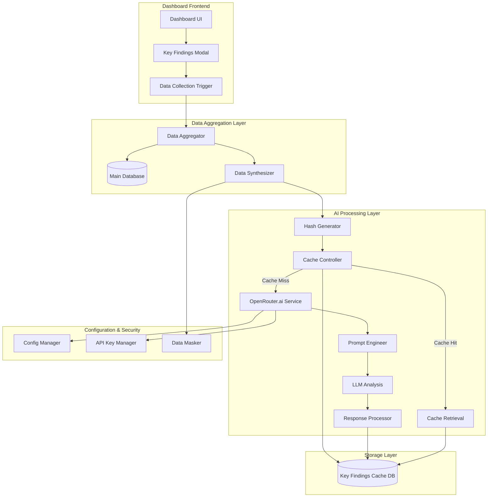
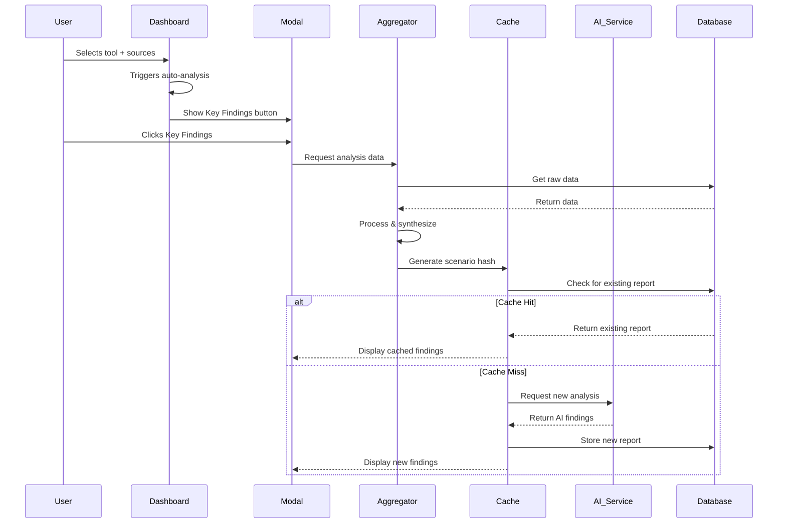
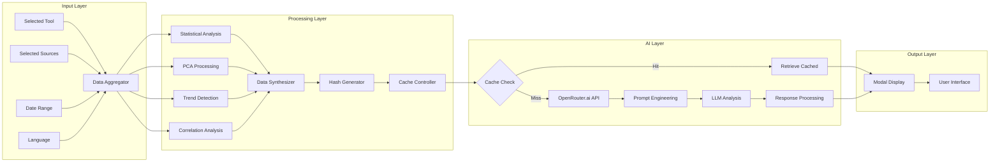

# Key Findings Module - Architectural Design

## Overview

The Key Findings module is an AI-powered analytics component that synthesizes multi-source dashboard data into doctoral-level executive summaries using OpenRouter.ai LLM analysis. The module operates as a modal/overlay system with intelligent caching to minimize API costs and provide instant results for previously analyzed scenarios.

## System Architecture



## Component Architecture

### 1. Database Schema Design

#### Key Findings Cache Database (`key_findings.db`)

```sql
-- Reports table for storing AI-generated findings
CREATE TABLE key_findings_reports (
    id INTEGER PRIMARY KEY AUTOINCREMENT,
    scenario_hash TEXT UNIQUE NOT NULL,
    tool_name TEXT NOT NULL,
    selected_sources TEXT NOT NULL, -- JSON array
    date_range_start TEXT,
    date_range_end TEXT,
    language TEXT DEFAULT 'es',

    -- AI Analysis Results
    principal_findings TEXT NOT NULL, -- JSON array
    pca_insights TEXT, -- JSON object
    executive_summary TEXT NOT NULL,

    -- Metadata
    model_used TEXT NOT NULL,
    api_latency_ms INTEGER,
    confidence_score REAL,
    generation_timestamp DATETIME DEFAULT CURRENT_TIMESTAMP,
    cache_version TEXT DEFAULT '1.0',

    -- User Interaction
    user_rating INTEGER, -- 1-5 stars
    user_feedback TEXT,
    access_count INTEGER DEFAULT 0,
    last_accessed DATETIME,

    -- Performance Metrics
    data_points_analyzed INTEGER,
    sources_count INTEGER,
    analysis_depth TEXT -- 'basic', 'comprehensive', 'doctoral'
);

-- Analysis history for tracking changes over time
CREATE TABLE key_findings_history (
    id INTEGER PRIMARY KEY AUTOINCREMENT,
    scenario_hash TEXT NOT NULL,
    report_id INTEGER NOT NULL,
    change_type TEXT NOT NULL, -- 'new', 'updated', 'rerun'
    previous_version_id INTEGER,
    change_timestamp DATETIME DEFAULT CURRENT_TIMESTAMP,
    change_reason TEXT,
    FOREIGN KEY (report_id) REFERENCES key_findings_reports(id)
);

-- Model performance tracking
CREATE TABLE model_performance (
    id INTEGER PRIMARY KEY AUTOINCREMENT,
    model_name TEXT NOT NULL,
    request_timestamp DATETIME DEFAULT CURRENT_TIMESTAMP,
    response_time_ms INTEGER,
    token_count INTEGER,
    success BOOLEAN,
    error_message TEXT,
    user_satisfaction INTEGER -- 1-5, if provided
);

-- Cache statistics for optimization
CREATE TABLE cache_statistics (
    id INTEGER PRIMARY KEY AUTOINCREMENT,
    date DATE NOT NULL,
    total_requests INTEGER DEFAULT 0,
    cache_hits INTEGER DEFAULT 0,
    cache_misses INTEGER DEFAULT 0,
    avg_response_time_ms REAL,
    unique_scenarios INTEGER DEFAULT 0
);
```

### 2. OpenRouter.ai Integration Service

#### `key_findings/ai_service.py`

```python
class OpenRouterService:
    """Service for interacting with OpenRouter.ai API"""

    def __init__(self, api_key: str, config: dict):
        self.api_key = api_key
        self.base_url = "https://openrouter.ai/api/v1"
        self.models = config.get('models', [
            'openai/gpt-4o-mini',
            'nvidia/llama-3.1-nemotron-70b-instruct',
            'meta-llama/llama-3.1-8b-instruct:free'
        ])
        self.timeout = config.get('timeout', 30)
        self.max_retries = config.get('max_retries', 3)

    async def generate_analysis(self, prompt: str, model: str = None) -> dict:
        """Generate AI analysis with fallback models"""

    async def test_model_availability(self) -> dict:
        """Test which models are currently available"""

    def calculate_cost(self, tokens: int, model: str) -> float:
        """Calculate API cost for request"""
```

### 3. Data Aggregation Pipeline

#### `key_findings/data_aggregator.py`

```python
class DataAggregator:
    """Aggregates and synthesizes data from multiple dashboard sources"""

    def __init__(self, db_manager, cache_manager):
        self.db_manager = db_manager
        self.cache_manager = cache_manager

    def collect_analysis_data(self, tool_name: str, selected_sources: List[str]) -> dict:
        """Collect all relevant data for AI analysis"""

    def extract_pca_insights(self, data: dict) -> dict:
        """Extract PCA-specific insights for emphasis"""

    def calculate_statistical_summaries(self, data: dict) -> dict:
        """Calculate comprehensive statistical summaries"""

    def identify_trends_and_anomalies(self, data: dict) -> dict:
        """Identify significant trends and anomalies"""

    def anonymize_sensitive_data(self, data: dict) -> dict:
        """Remove or anonymize sensitive information before LLM processing"""
```

### 4. Prompt Engineering System

#### `key_findings/prompt_engineer.py`

```python
class PromptEngineer:
    """Creates sophisticated prompts for doctoral-level analysis"""

    def __init__(self, language: str = 'es'):
        self.language = language
        self.prompt_templates = self._load_templates()

    def create_analysis_prompt(self, data: dict, context: dict) -> str:
        """Create comprehensive analysis prompt"""

    def create_pca_focused_prompt(self, pca_data: dict, context: dict) -> str:
        """Create PCA-focused analysis prompt"""

    def create_executive_summary_prompt(self, findings: dict) -> str:
        """Create prompt for executive summary generation"""

    def _load_templates(self) -> dict:
        """Load bilingual prompt templates"""
```

### 5. Modal/Overlay UI Component

#### `key_findings/modal_component.py`

```python
class KeyFindingsModal:
    """Modal component for displaying Key Findings"""

    def __init__(self, app, language_store):
        self.app = app
        self.language_store = language_store

    def create_modal_layout(self) -> dbc.Modal:
        """Create the modal layout with all sections"""

    def create_findings_display(self, report_data: dict) -> html.Div:
        """Create formatted display of AI findings"""

    def create_interaction_controls(self) -> html.Div:
        """Create user interaction controls (save, rerun, rate)"""

    def create_loading_state(self) -> html.Div:
        """Create loading animation during AI processing"""
```

## Integration Flow

### 1. Trigger Mechanism



### 2. Data Flow Architecture



## Configuration Management

### 1. Environment Configuration

#### `.env` additions

```env
# OpenRouter.ai Configuration
OPENROUTER_API_KEY=your_api_key_here
OPENROUTER_BASE_URL=https://openrouter.ai/api/v1
OPENROUTER_TIMEOUT=30
OPENROUTER_MAX_RETRIES=3

# Key Findings Configuration
KEY_FINDINGS_DB_PATH=key_findings.db
KEY_FINDINGS_CACHE_TTL=86400  # 24 hours
KEY_FINDINGS_MAX_HISTORY=100
KEY_FINDINGS_AUTO_GENERATE=true

# Model Configuration
PRIMARY_MODEL=openai/gpt-4o-mini
FALLBACK_MODELS=nvidia/llama-3.1-nemotron-70b-instruct,meta-llama/llama-3.1-8b-instruct:free
```

### 2. Configuration Schema

#### `key_findings/config.py`

```python
@dataclass
class KeyFindingsConfig:
    """Configuration for Key Findings module"""

    # API Configuration
    api_key: str
    base_url: str = "https://openrouter.ai/api/v1"
    timeout: int = 30
    max_retries: int = 3

    # Model Configuration
    primary_model: str = "openai/gpt-4o-mini"
    fallback_models: List[str] = field(default_factory=lambda: [
        "nvidia/llama-3.1-nemotron-70b-instruct",
        "meta-llama/llama-3.1-8b-instruct:free"
    ])

    # Cache Configuration
    cache_ttl: int = 86400  # 24 hours
    max_history: int = 100
    auto_generate: bool = True

    # Analysis Configuration
    max_data_points: int = 10000
    pca_emphasis_weight: float = 0.3
    confidence_threshold: float = 0.7

    # Security Configuration
    anonymize_data: bool = True
    max_token_limit: int = 4000
```

## Security & Performance Considerations

### 1. Data Security

- **Anonymization**: Remove sensitive identifiers before LLM processing
- **Rate Limiting**: Implement API rate limiting to prevent abuse
- **Data Masking**: Mask proprietary information in prompts
- **Audit Trail**: Log all AI interactions for compliance

### 2. Performance Optimization

- **Intelligent Caching**: Hash-based scenario identification
- **Lazy Loading**: Load findings only when requested
- **Batch Processing**: Process multiple analyses in batches
- **Connection Pooling**: Reuse database connections
- **Async Processing**: Non-blocking AI API calls

### 3. Error Handling

- **Graceful Degradation**: Fallback to cached or simplified analysis
- **Retry Logic**: Automatic retries with exponential backoff
- **Model Fallback**: Switch to alternative models on failure
- **User Notification**: Clear error messages and recovery options

## Bilingual Support Strategy

### 1. Content Translation

- **AI Prompts**: Bilingual prompt templates
- **UI Elements**: Integrated with existing translation system
- **Findings Display**: Language-aware formatting
- **Executive Summaries**: Generated in user's preferred language

### 2. Cultural Adaptation

- **Academic Standards**: Adapt to regional academic conventions
- **Terminology**: Field-specific translation management
- **Formatting**: Locale-appropriate date and number formats

## Testing Strategy

### 1. Unit Tests

- AI Service integration tests
- Data aggregation pipeline tests
- Cache logic tests
- Prompt engineering tests

### 2. Integration Tests

- End-to-end workflow tests
- Modal interaction tests
- Database integration tests
- Error handling tests

### 3. Performance Tests

- API response time tests
- Cache efficiency tests
- Concurrent user tests
- Memory usage tests

## Deployment Considerations

### 1. Database Migration

- Schema versioning
- Data migration scripts
- Backup procedures
- Rollback plans

### 2. Configuration Management

- Environment-specific configs
- Secret management
- Feature flags
- Monitoring setup

### 3. Monitoring & Analytics

- API usage metrics
- Cache hit rates
- User satisfaction tracking
- Performance monitoring

## Future Enhancements

### 1. Advanced Features

- Comparative analysis across tools
- Trend prediction capabilities
- Interactive finding exploration
- Export functionality (PDF, Word)

### 2. AI Improvements

- Fine-tuned models for domain
- Multi-modal analysis (charts + text)
- Real-time collaboration features
- Expert system integration

### 3. User Experience

- Personalized insights
- Learning algorithm adaptation
- Voice interaction
- Mobile optimization
