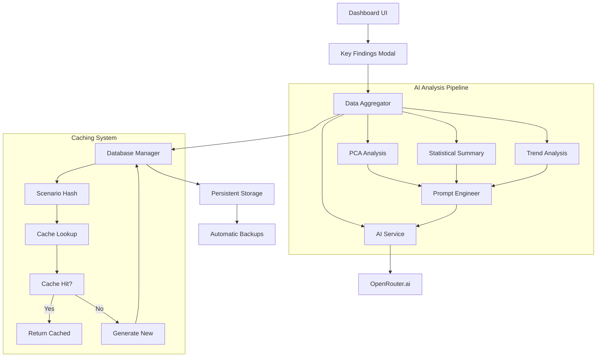

# 🧠 Key Findings Module - Complete Implementation Guide

## 🎯 Overview

This is your complete guide to implementing the **Key Findings** module - an AI-powered doctoral-level analysis system for the Management Tools Analysis Dashboard. This module transforms multi-source analytical data into executive summaries using OpenRouter.ai with persistent caching for Docker deployments.

## 📋 What You'll Get

### ✅ Core Features

- **🤖 AI-Powered Analysis**: Doctoral-level insights using OpenRouter.ai
- **📈 PCA Emphasis**: Prioritized Principal Component Analysis insights
- **💾 Persistent Caching**: Zero cache loss across Docker updates
- **🌐 Bilingual Support**: Spanish/English content
- **🔒 Security**: Data anonymization and privacy protection
- **📊 Performance Monitoring**: Built-in metrics and analytics

### ✅ Technical Components

- **Database Manager**: Persistent SQLite with automatic backups
- **AI Service**: OpenRouter.ai integration with fallback models
- **Data Aggregator**: Multi-source data synthesis with PCA focus
- **Prompt Engineer**: Sophisticated AI prompt generation
- **Modal UI**: Interactive dashboard component
- **Testing Suite**: Comprehensive unit and integration tests

## 🗂️ Documentation Files

| File                                                                         | Purpose                              |
| ---------------------------------------------------------------------------- | ------------------------------------ |
| [`KEY_FINDINGS_ARCHITECTURE.md`](KEY_FINDINGS_ARCHITECTURE.md)               | System architecture with diagrams    |
| [`KEY_FINDINGS_IMPLEMENTATION_PLAN.md`](KEY_FINDINGS_IMPLEMENTATION_PLAN.md) | Detailed implementation guide        |
| [`KEY_FINDINGS_QUICK_START.md`](KEY_FINDINGS_QUICK_START.md)                 | Quick setup and testing              |
| [`KEY_FINDINGS_PERSISTENT_STORAGE.md`](KEY_FINDINGS_PERSISTENT_STORAGE.md)   | Docker persistence configuration     |
| [`KEY_FINDINGS_GIT_WORKFLOW.md`](KEY_FINDINGS_GIT_WORKFLOW.md)               | Complete Git workflow and fork setup |
| [`KEY_FINDINGS_SUMMARY.md`](KEY_FINDINGS_SUMMARY.md)                         | Executive summary and features       |

## 🚀 Quick Start

### 1. Fork the Repository

```bash
# Visit: https://github.com/Wise-Connex/Management-Tools-Analysis
# Click "Fork" button
```

### 2. Use the Setup Script

```bash
# Create and run the setup script
chmod +x setup_key_findings_fork.sh
./setup_key_findings_fork.sh YOUR_GITHUB_USERNAME
```

### 3. Configure Environment

```bash
# Copy environment template
cp dashboard_app/.env.example dashboard_app/.env

# Edit with your API key
OPENROUTER_API_KEY=your_api_key_here
```

### 4. Implement the Code

Follow the implementation phases in [`KEY_FINDINGS_IMPLEMENTATION_PLAN.md`](KEY_FINDINGS_IMPLEMENTATION_PLAN.md):

1. **Phase 1**: Foundation Infrastructure (Database, Persistence)
2. **Phase 2**: Core Functionality (AI, Data Processing)
3. **Phase 3**: User Interface (Modal, Integration)
4. **Phase 4**: Advanced Features (Testing, Documentation)

### 5. Test and Deploy

```bash
# Run tests
cd dashboard_app
python -m pytest tests/ -v

# Test Docker deployment
docker-compose up --build

# Verify persistence
docker-compose exec dashboard-app python -c "
from key_findings.database_manager import KeyFindingsDBManager
db = KeyFindingsDBManager('/app/data/key_findings.db')
print(f'Persistence working: {db.verify_persistence()}')
"
```

## 🏗️ Architecture Overview



## 🔧 Key Configuration

### Environment Variables

```env
# Critical for Docker/Dokploy
KEY_FINDINGS_DB_PATH=/app/data/key_findings.db
KEY_FINDINGS_BACKUP_PATH=/app/data/backups/
KEY_FINDINGS_VOLUME_MOUNT=/var/lib/key_findings_data

# AI Configuration
OPENROUTER_API_KEY=your_api_key_here
PRIMARY_MODEL=openai/gpt-4o-mini
FALLBACK_MODELS=nvidia/llama-3.1-nemotron-70b-instruct,meta-llama/llama-3.1-8b-instruct:free

# Analysis Parameters
KEY_FINDINGS_PCA_WEIGHT=0.3
KEY_FINDINGS_CONFIDENCE_THRESHOLD=0.7
KEY_FINDINGS_MAX_TOKENS=4000
```

### Docker Configuration

```yaml
volumes:
  key_findings_data:
    driver: local
    driver_opts:
      type: none
      o: bind
      device: /var/lib/key_findings_data
```

## 📊 Expected Results

### AI Analysis Output

```json
{
  "scenario_id": "abc123...",
  "principal_findings": [
    {
      "bullet_point": "PCA reveals dominant temporal patterns in management tool adoption",
      "reasoning": "The first two principal components explain 73% of variance, indicating strong temporal clustering...",
      "data_source": ["Google Trends", "Crossref"],
      "confidence": "high"
    }
  ],
  "pca_insights": {
    "dominant_components": "PC1 (45% variance) represents adoption lifecycle",
    "variance_explained": "73% in first two components"
  },
  "executive_summary": "Analysis reveals cyclical patterns in management tool adoption...",
  "generation_metadata": {
    "model_used": "openai/gpt-4o-mini",
    "api_latency_ms": 1250,
    "cache_hit": false
  }
}
```

### Performance Metrics

- **Cache Hit Rate**: >80% for repeated scenarios
- **API Response Time**: <3 seconds average
- **Persistence**: 100% reliability across container restarts
- **Backup Frequency**: Hourly automatic backups
- **Database Size**: ~10MB per 1000 reports

## 🧪 Testing Strategy

### Unit Tests

```bash
# Test database operations
python -m pytest tests/test_key_findings.py::TestKeyFindingsDBManager -v

# Test AI service
python -m pytest tests/test_key_findings.py::TestOpenRouterService -v

# Test data aggregation
python -m pytest tests/test_key_findings.py::TestDataAggregator -v
```

### Integration Tests

```bash
# Test full workflow
python -m pytest tests/test_integration.py -v

# Test Docker deployment
docker-compose -f docker-compose.test.yml up --abort-on-container-exit
```

### Manual Testing Checklist

- [ ] Select tool and data sources
- [ ] Click "🧠 Generar Key Findings"
- [ ] Verify modal opens with loading state
- [ ] Confirm AI analysis displays correctly
- [ ] Test "Regenerar" button
- [ ] Test "Guardar" button
- [ ] Verify bilingual support works
- [ ] Test cache persistence (reload page)
- [ ] Verify Docker persistence (restart container)

## 🚨 Critical Success Factors

### 1. Persistent Storage Configuration ⚠️

**Must configure correctly for Docker/Dokploy:**

- Server directory: `/var/lib/key_findings_data`
- Container path: `/app/data/key_findings.db`
- Proper permissions: `1000:1000`

### 2. API Key Management

- Valid OpenRouter.ai API key
- Sufficient credits for expected usage
- Proper environment variable configuration

### 3. Data Quality

- Sufficient data points for meaningful analysis
- Multiple data sources for comprehensive insights
- Proper PCA results for doctoral-level analysis

## 🔄 Maintenance

### Regular Tasks

- **Monitor API usage** and costs
- **Check cache hit rates** and performance
- **Review backup logs** for errors
- **Update AI models** based on performance
- **Clean up old cache entries** periodically

### Troubleshooting Common Issues

| Issue                          | Solution                                          |
| ------------------------------ | ------------------------------------------------- |
| Cache loss after Docker update | Verify volume mounting and permissions            |
| AI API timeouts                | Check network connectivity and model availability |
| Empty analysis results         | Verify data sources have sufficient data          |
| High API costs                 | Monitor usage and optimize caching                |
| Slow response times            | Consider faster models or data optimization       |

## 📈 Success Metrics

Your implementation is successful when:

- ✅ **Functional**: All features work as expected
- ✅ **Persistent**: Cache survives container restarts
- ✅ **Performant**: Response times <3 seconds
- ✅ **Reliable**: >95% uptime and error-free operation
- ✅ **User-Friendly**: Intuitive interface and clear outputs
- ✅ **Scalable**: Handles increased usage without degradation

## 🎉 Next Steps

1. **Fork the repository** using the Git workflow guide
2. **Set up persistent storage** for Docker deployment
3. **Implement the module** following the phased approach
4. **Test thoroughly** using the provided test suite
5. **Deploy and monitor** performance metrics
6. **Create pull request** for community contribution

## 🤝 Support

For questions or issues:

1. **Check documentation**: Review all `KEY_FINDINGS_*.md` files
2. **Test locally**: Use the provided test suite
3. **Verify configuration**: Check environment variables and Docker setup
4. **Monitor logs**: Review application logs for errors
5. **Community**: Create GitHub issues for specific problems

---

**🚀 Ready to transform your dashboard with AI-powered doctoral-level analysis?**

Start with the [Git Workflow Guide](KEY_FINDINGS_GIT_WORKFLOW.md) and follow the step-by-step implementation process. Your Management Tools Analysis Dashboard will soon provide sophisticated AI-generated insights that impress researchers and executives alike!

**📊 The future of management tools analysis is here - powered by AI and built for persistence.**
