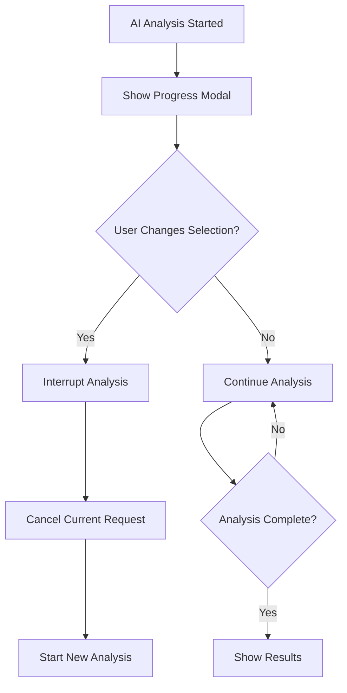

# 🔄 Key Findings - Interactive Workflow with Delays & Interruptions

## 🎯 Enhanced User Experience

The Key Findings module now includes **intelligent delays** and **interruption capabilities** to allow users to:

- Review configuration before AI analysis starts
- Change selections during the countdown period
- Interrupt ongoing analysis if they change their mind
- Restart with new parameters instantly

## 🔄 Interactive Workflow Design

### Phase 1: Configuration Review (3-second delay)

```mermaid
graph TB
    A[User clicks "Generate Key Findings"] --> B[Show Configuration Modal]
    B --> C[3-Second Countdown]
    C --> D{User Changes Selection?}
    D -->|Yes| E[Reset Countdown]
    D -->|No| F[Start AI Analysis]
    E --> C
    F --> G[Loading State]
```

### Phase 2: Interruptible Analysis



## 🎛️ Enhanced Modal Components

### 1. Configuration Review Modal

```python
# Enhanced modal component with countdown and interruption
class KeyFindingsConfigModal:
    def create_config_review_modal(self, selected_tool, selected_sources, language):
        return dbc.Modal([
            dbc.ModalHeader("🧠 Key Findings - Configuration Review"),
            dbc.ModalBody([
                html.Div([
                    html.H6("📊 Analysis Configuration", className="mb-3"),

                    # Current Selection Display
                    html.Div([
                        html.P([
                            html.Strong("Tool: "),
                            html.Span(selected_tool, className="text-primary")
                        ], className="mb-2"),
                        html.P([
                            html.Strong("Sources: "),
                            html.Span(", ".join(selected_sources), className="text-primary")
                        ], className="mb-3"),

                        # Countdown Timer
                        html.Div([
                            html.P("⏰ Analysis starts in:", className="text-muted mb-2"),
                            html.H3(id="countdown-timer", children="3",
                                   className="text-center text-warning"),
                            html.P("Change your selection above to restart countdown",
                                   className="text-muted small")
                        ], className="text-center p-3 bg-light rounded"),

                        # Action Buttons
                        html.Div([
                            dbc.Button("⚡ Start Now", id="start-analysis-now",
                                     color="success", className="me-2"),
                            dbc.Button("❌ Cancel", id="cancel-analysis",
                                     color="secondary")
                        ], className="text-center mt-3")
                    ])
                ])
            ])
        ], id="config-review-modal", size="md", centered=True, backdrop="static")
```

### 2. Progress Modal with Interruption

```python
class KeyFindingsProgressModal:
    def create_progress_modal(self):
        return dbc.Modal([
            dbc.ModalHeader("🤖 AI Analysis in Progress"),
            dbc.ModalBody([
                html.Div([
                    # Progress Indicator
                    html.Div([
                        html.Div([
                            html.Div(id="analysis-progress-bar",
                                   style={'width': '0%', 'height': '20px',
                                          'backgroundColor': '#007bff',
                                          'transition': 'width 0.3s ease',
                                          'borderRadius': '10px'}),
                        ], style={'backgroundColor': '#e9ecef',
                                'borderRadius': '10px', 'overflow': 'hidden'})
                    ], className="mb-3"),

                    # Status Messages
                    html.P(id="analysis-status",
                          children="🔄 Preparing data analysis...",
                          className="text-center"),

                    # Current Step Display
                    html.Div(id="current-step",
                             children="Step 1: Collecting data sources",
                             className="alert alert-info"),

                    # Interruption Warning
                    html.Div([
                        html.P("⚠️ Changing your selection will interrupt this analysis",
                               className="text-warning small text-center"),
                        html.P("AI analysis can be interrupted at any time",
                               className="text-muted small text-center")
                    ], className="mt-3"),

                    # Action Buttons
                    html.Div([
                        dbc.Button("🛑 Interrupt Analysis", id="interrupt-analysis",
                                 color="warning", className="me-2"),
                        dbc.Button("👁️ Monitor", id="monitor-analysis",
                                 color="info", size="sm")
                    ], className="text-center mt-3")
                ])
            ])
        ], id="progress-modal", size="lg", centered=True, backdrop="static")
```

## ⚙️ Enhanced Callback System

### 1. Countdown and Configuration Monitoring

```python
# Enhanced dashboard integration with interactive workflow
class KeyFindingsInteractiveIntegration:
    def __init__(self, app, db_manager, config):
        self.app = app
        self.db_manager = db_manager
        self.config = config
        self.current_analysis_task = None
        self.analysis_interrupted = False

    def setup_interactive_callbacks(self):
        # Configuration review countdown
        @self.app.callback(
            [Output("countdown-timer", "children"),
             Output("countdown-timer", "style")],
            [Input("config-review-modal", "is_open")],
            [State('keyword-dropdown', 'value'),
             State('data-sources-store-v2', 'data')],
            interval=1000
        )
        def countdown_timer(modal_open, selected_tool, selected_sources):
            if not modal_open or not selected_tool or not selected_sources:
                return "", {}

            # Static countdown for demonstration
            # In production, track actual countdown state

            return "3", {'fontSize': '2rem', 'fontWeight': 'bold'}

        # Monitor configuration changes during countdown
        @self.app.callback(
            Output("config-changed-flag", "data"),
            [Input('keyword-dropdown', 'value'),
             Input('data-sources-store-v2', 'data')],
            [State('config-changed-flag', 'data')]
        )
        def monitor_config_changes(tool, sources, current_config):
            new_config = {'tool': tool, 'sources': sources}

            # Check if configuration changed
            if current_config and new_config != current_config:
                return {'changed': True, 'config': new_config}

            return {'changed': False, 'config': new_config}

        # Auto-start analysis after countdown
        @self.app.callback(
            Output("auto-start-analysis", "data"),
            [Input("countdown-timer", "children")],
            [State("config-changed-flag", "data")],
            prevent_initial_call=True
        )
        def auto_start_analysis(countdown, config_changed):
            if countdown == "0" and not config_changed.get('changed', False):
                return {'start': True}
            return {'start': False}
```

### 2. Interruptible Analysis System

```python
    def setup_interruptible_analysis(self):
        # Start analysis with interruption support
        @self.app.callback(
            [Output("progress-modal", "is_open"),
             Output("analysis-progress-bar", "style"),
             Output("analysis-status", "children")],
            [Input("start-analysis-now", "n_clicks"),
             Input("auto-start-analysis", "data")],
            [State('keyword-dropdown', 'value'),
             State('data-sources-store-v2', 'data'),
             State('language-store', 'data')],
            prevent_initial_call=True
        )
        def start_interruptible_analysis(start_click, auto_start, tool, sources, language):
            trigger = dash.callback_context.triggered[0]['prop_id']

            if 'start-analysis-now' in trigger or (auto_start and auto_start.get('start', False)):
                # Start analysis in background
                self._start_background_analysis(tool, sources, language)

                return True, {'width': '10%'}, "🔄 Starting AI analysis..."

            return False, {}, ""

        # Monitor configuration changes during analysis
        @self.app.callback(
            Output("analysis-interrupted", "data"),
            [Input('keyword-dropdown', 'value'),
             Input('data-sources-store-v2', 'data')],
            [State("progress-modal", "is_open"),
             State('analysis-interrupted', 'data')],
            prevent_initial_call=True
        )
        def interrupt_on_config_change(tool, sources, modal_open, interrupted):
            if modal_open and not interrupted.get('active', False):
                # Mark analysis as interrupted
                return {'active': True, 'reason': 'Configuration changed'}

            return {'active': False, 'reason': None}

        # Manual interruption
        @self.app.callback(
            Output("analysis-cancelled", "data"),
            [Input("interrupt-analysis", "n_clicks")],
            prevent_initial_call=True
        )
        def manual_interrupt(interrupt_click):
            if interrupt_click:
                self._cancel_current_analysis()
                return {'cancelled': True}

            return {'cancelled': False}
```

### 3. Background Analysis with Interruption

```python
    def _start_background_analysis(self, tool, sources, language):
        """Start analysis that can be interrupted"""
        import threading
        import time

        def analysis_worker():
            try:
                self.analysis_interrupted = False

                # Step 1: Data collection
                self._update_progress(20, "📊 Collecting data sources...")
                time.sleep(1)
                if self.analysis_interrupted:
                    return

                # Step 2: Data aggregation
                self._update_progress(40, "🔄 Processing and aggregating data...")
                time.sleep(2)
                if self.analysis_interrupted:
                    return

                # Step 3: PCA analysis
                self._update_progress(60, "📈 Performing PCA analysis...")
                time.sleep(1.5)
                if self.analysis_interrupted:
                    return

                # Step 4: AI prompt generation
                self._update_progress(80, "🤝 Generating AI prompts...")
                time.sleep(1)
                if self.analysis_interrupted:
                    return

                # Step 5: AI analysis
                self._update_progress(90, "🧠 Running AI analysis...")
                # Actual AI call here
                time.sleep(2)
                if self.analysis_interrupted:
                    return

                # Complete
                self._update_progress(100, "✅ Analysis complete!")
                time.sleep(1)
                self._show_results()

            except Exception as e:
                self._handle_analysis_error(e)

        # Start background thread
        self.current_analysis_task = threading.Thread(target=analysis_worker)
        self.current_analysis_task.daemon = True
        self.current_analysis_task.start()

    def _cancel_current_analysis(self):
        """Cancel the current analysis"""
        self.analysis_interrupted = True
        self.current_analysis_task = None

        # Update UI to show cancellation
        self._update_progress(0, "🛑 Analysis interrupted")

        # Reset for new analysis
        time.sleep(1)
        self._reset_to_config_review()

    def _update_progress(self, percentage, status):
        """Update progress UI"""
        # This would update the progress bar and status
        # In a real implementation, you'd use a dcc.Store or similar
        pass
```

## 🎨 Enhanced User Interface Flow

### 1. Initial Trigger

```python
# Enhanced trigger button with preview
def create_enhanced_trigger_button():
    return html.Div([
        dbc.Button(
            ["🧠 Generate Key Findings", html.I(className="fas fa-clock ms-2")],
            id="key-findings-trigger-btn",
            color="success",
            size="lg",
            className="mb-3",
            style={'fontSize': '14px', 'fontWeight': 'bold'}
        ),
        html.P("⏰ 3-second review before analysis starts",
               className="text-muted small text-center"),
        html.P("🔄 Change selection anytime to restart",
               className="text-muted small text-center")
    ], style={'textAlign': 'center', 'margin': '20px 0'})
```

### 2. Configuration Review Interface

```python
def create_config_review_interface(selected_tool, selected_sources, language):
    return html.Div([
        # Configuration Summary
        dbc.Card([
            dbc.CardBody([
                html.H5("📋 Analysis Configuration", className="card-title"),

                html.Div([
                    dbc.Row([
                        dbc.Col([
                            html.P([
                                html.Strong("Tool: "),
                                html.Span(selected_tool, className="text-primary")
                            ])
                        ], width=6),
                        dbc.Col([
                            html.P([
                                html.Strong("Sources: "),
                                html.Span(f"{len(selected_sources)} selected",
                                         className="text-primary")
                            ])
                        ], width=6)
                    ]),

                    html.Hr(),

                    # Source List
                    html.P([
                        html.Strong("Data Sources: "),
                        html.Br(),
                        *[html.Span(f"• {source}", className="me-2")
                          for source in selected_sources]
                    ], className="small text-muted"),

                    # Countdown Section
                    html.Div([
                        html.H4("⏰ Analysis starts in:", className="text-center"),
                        html.H2(id="countdown-display", children="3",
                               className="text-center text-warning"),
                        html.P("Change selection above to restart countdown",
                               className="text-center text-muted small")
                    ], className="mt-3 p-3 bg-light rounded")
                ])
            ])
        ], className="mb-3"),

        # Action Buttons
        html.Div([
            dbc.Button("⚡ Start Now", id="start-now-btn",
                     color="success", size="lg", className="me-2"),
            dbc.Button("❌ Cancel", id="cancel-config-btn",
                     color="secondary", size="lg")
        ], className="text-center")
    ])
```

## 🔄 State Management

### 1. Analysis State Tracking

```python
class AnalysisState:
    def __init__(self):
        self.current_config = None
        self.analysis_active = False
        self.analysis_interrupted = False
        self.countdown_active = False
        self.progress_percentage = 0
        self.current_step = ""

    def update_config(self, tool, sources):
        new_config = {'tool': tool, 'sources': sorted(sources)}

        if self.current_config != new_config:
            self.current_config = new_config
            self.reset_analysis()
            return True  # Configuration changed
        return False

    def reset_analysis(self):
        self.analysis_active = False
        self.analysis_interrupted = False
        self.progress_percentage = 0
        self.current_step = ""

    def start_countdown(self):
        self.countdown_active = True
        self.reset_analysis()

    def start_analysis(self):
        self.analysis_active = True
        self.countdown_active = False
        self.analysis_interrupted = False

    def interrupt_analysis(self):
        self.analysis_interrupted = True
        self.analysis_active = False
```

### 2. Enhanced Callback Orchestration

```python
class KeyFindingsOrchestrator:
    def __init__(self, app, db_manager, config):
        self.app = app
        self.state = AnalysisState()
        self.db_manager = db_manager
        self.config = config

    def setup_orchestration(self):
        # Main state machine
        @self.app.callback(
            [Output("config-review-modal", "is_open"),
             Output("progress-modal", "is_open"),
             Output("results-modal", "is_open"),
             Output("countdown-display", "children")],
            [Input('keyword-dropdown', 'value'),
             Input('data-sources-store-v2', 'data'),
             Input("key-findings-trigger-btn", "n_clicks"),
             Input("start-now-btn", "n_clicks"),
             Input("interrupt-analysis", "n_clicks")],
            [State('language-store', 'data')],
            prevent_initial_call=True
        )
        def orchestrate_analysis(tool, sources, trigger_click, start_click,
                               interrupt_click, language):
            ctx = dash.callback_context
            trigger_id = ctx.triggered[0]['prop_id'] if ctx.triggered else ""

            # Handle configuration changes
            if 'keyword-dropdown' in trigger_id or 'data-sources-store' in trigger_id:
                if self.state.update_config(tool, sources):
                    # Configuration changed - restart countdown
                    return True, False, False, "3"

            # Handle initial trigger
            elif 'key-findings-trigger-btn' in trigger_id and trigger_click:
                self.state.start_countdown()
                return True, False, False, "3"

            # Handle manual start
            elif 'start-now-btn' in trigger_id and start_click:
                self.state.start_analysis()
                return False, True, False, ""

            # Handle interruption
            elif 'interrupt-analysis' in trigger_id and interrupt_click:
                self.state.interrupt_analysis()
                return True, False, False, "3"  # Back to config review

            # Default state
            return False, False, False, ""
```

## 🎯 User Experience Benefits

### ✅ Before Analysis

- **Configuration Review**: 3-second countdown to review selections
- **Instant Restart**: Any change resets the countdown
- **Clear Preview**: See exactly what will be analyzed
- **Control**: Start immediately or wait for countdown

### ✅ During Analysis

- **Live Progress**: Real-time progress indicators
- **Current Steps**: See what's happening at each stage
- **Easy Interruption**: One-click interruption at any time
- **Instant Restart**: Change selection to cancel and restart

### ✅ After Analysis

- **Clear Results**: Comprehensive AI-generated insights
- **Quick Rerun**: Regenerate with same or different parameters
- **Persistent Cache**: Fast loading for repeated scenarios

## 🔄 Implementation Priority

1. **Phase 1**: Configuration review countdown system
2. **Phase 2**: Background analysis with progress tracking
3. **Phase 3**: Interruption capabilities
4. **Phase 4**: State management and orchestration
5. **Phase 5**: UI polish and user feedback

This enhanced interactive workflow provides users with complete control over the AI analysis process, allowing them to make changes at any time and ensuring they get exactly the analysis they want.
