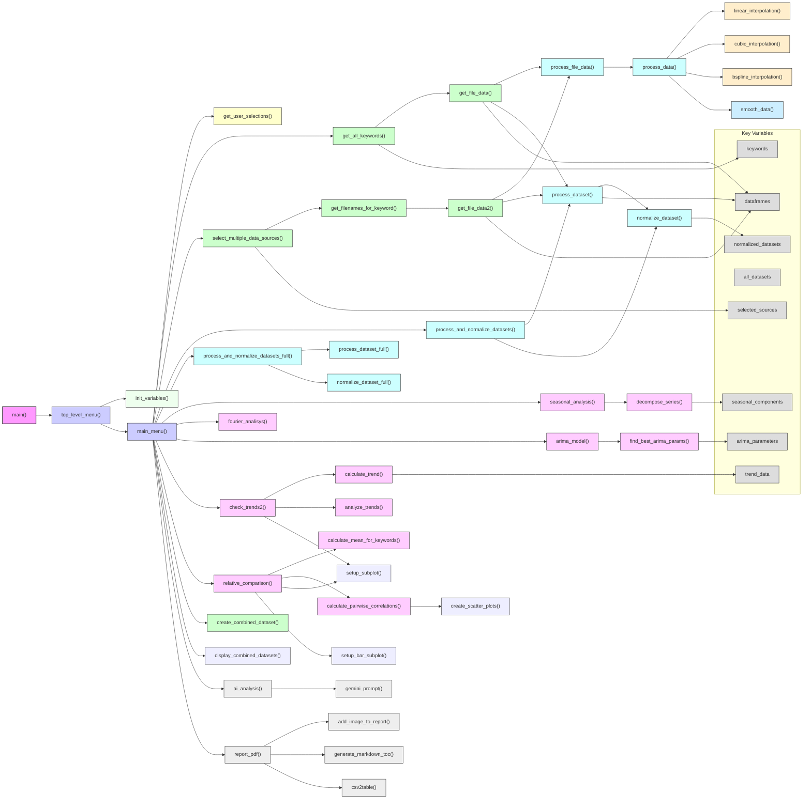

# Correlation.py Function Overview by Analysis Phase

## 1. Data Loading & Preprocessing

- **Data Acquisition:**

  - `get_file_data()` - Loads data from files in the 'dbase' folder
  - `get_file_data2()` - Loads data for specific keywords and sources
  - `get_all_keywords()` - Retrieves all available keywords from the system
  - `get_filenames_for_keyword()` - Maps keywords to their corresponding filenames

- **Source Selection:**

  - `select_multiple_data_sources()` - Interactive UI for selecting data sources
  - `get_user_selections()` - Handles user selections from various option menus

- **Data Processing:**

  - `process_data()` - General data processing function
  - `process_file_data()` - Processes raw file data into usable format
  - `process_dataset()` - Processes dataset based on source type (converts monthly to annual format for GB)
  - `process_dataset_full()` - More comprehensive dataset processing
  - `remove_ispartial()` - Removes partial/incomplete data points
  - `rem_isPartial()` - Alternative implementation for removing partial data

- **Data Normalization:**
  - `normalize_dataset()` - Normalizes dataset values for comparison
  - `normalize_dataset_full()` - More comprehensive dataset normalization
  - `process_and_normalize_datasets()` - Combined processing and normalization
  - `process_and_normalize_datasets_full()` - More comprehensive version

## 2. Data Interpolation & Smoothing

- **Interpolation Methods:**

  - `linear_interpolation()` - Fills gaps using linear interpolation
  - `cubic_interpolation()` - Fills gaps using cubic spline interpolation
  - `bspline_interpolation()` - Fills gaps using B-spline interpolation

- **Smoothing:**
  - `smooth_data()` - Smooths time series data using specified window size

## 3. Time Series Analysis

- **Decomposition:**

  - `seasonal_analysis()` - Analyzes seasonality in time series data
  - `decompose_series()` - Decomposes time series into trend, seasonal, and residual components
  - `fourier_analisys()` - Performs Fourier analysis to identify periodic patterns

- **ARIMA Modeling:**

  - `find_best_arima_params()` - Finds optimal ARIMA parameters for a dataset
  - `arima_model()` - Implements ARIMA modeling for time series forecasting

- **Trend Analysis:**
  - `calculate_yearly_average()` - Calculates yearly averages from time series data
  - `calculate_trend()` - Calculates trend direction and magnitude
  - `check_trends2()` - Comprehensive trend analysis function
  - `analyze_trends()` - Provides deeper analysis of trend patterns

## 4. Correlation & Relationship Analysis

- **Data Integration:**

  - `create_combined_dataset()` - Creates a combined dataset from multiple sources
  - `create_combined_dataset2()` - Alternative implementation
  - `display_combined_datasets()` - Displays combined datasets for analysis

- **Statistical Analysis:**
  - `relative_comparison()` - Compares data across different sources
  - `calculate_mean_for_keywords()` - Calculates mean values for sets of keywords
  - `calculate_pairwise_correlations()` - Calculates correlation coefficients between variables
  - `dictionary_to_dataframe()` - Utility to convert dictionaries to DataFrames for analysis

## 5. Visualization & Plotting

- **Plot Setup:**

  - `setup_subplot()` - Configures subplot for visualization
  - `setup_bar_subplot()` - Configures bar subplot for visualization
  - `format_month()` & `format_month2()` - Format month labels for time series plots
  - `add_labels()` - Adds labels to plot elements

- **Specialized Plots:**
  - `create_scatter_plots()` - Creates scatter plots for correlation visualization

## 6. AI-Powered Analysis & Reporting

- **AI Analysis:**

  - `ai_analysis()` - Implements AI-based analysis on the datasets
  - `gemini_prompt()` - Interfaces with Gemini AI for advanced analysis

- **Report Generation:**
  - `report_pdf()` - Generates comprehensive PDF reports
  - `add_image_to_report()` - Adds images to reports
  - `generate_markdown_toc()` - Generates table of contents in markdown
  - `csv2table()` - Converts CSV data to formatted table for reports

## 7. Utility Functions

- **Formatting:**

  - `banner_msg()` - Creates formatted banner messages for the UI
  - `eng_notation()` & `eng_format()` - Handles engineering notation for numbers
  - `PPRINT()` - Enhanced print function with formatting
  - `replace_spaces_with_newlines()` - Text formatting utility

- **File Management:**
  - `get_unique_filename()` - Generates unique filenames to prevent overwrites
  - `create_unique_filename()` - Creates filenames based on keyword combinations

## 8. Program Flow & UI

- **Menu Systems:**
  - `main_menu()` - Main interactive menu
  - `top_level_menu()` - Top-level program menu
  - `results()` - Displays analysis results to users
  - `init_variables()` - Initializes program variables
  - `main()` - Main program entry point and execution flow

## 9. Function Relationships Flowchart

## Variable Flow Between Key Functions

**Main Program Flow Variables:**

- `dbase_options`: Contains database configuration options
- `tool_file_dic`: Dictionary mapping tools to their filenames
- `selected_sources`: List of source identifiers selected by user
- `selected_keyword`: Current keyword being analyzed

**Data Processing Variables:**

- `df`: Input DataFrame containing raw data
- `all_datasets`: Dictionary containing all loaded datasets
- `datasets_norm`: Dictionary of normalized datasets
- `earliest_date`/`latest_date`: Global date boundaries for analysis

**Analysis Variables:**

- `mean`: Processed mean values for visualization
- `trend`: Calculated trend direction and magnitude
- `seasonal_components`: Output from seasonal decomposition
- `corrMatrix`: Correlation matrix between variables
- `forecast`: ARIMA model forecasts

**Reporting Variables:**

- `report_content`: Markdown/HTML content for report
- `figures`: Generated plot figures for report inclusion
- `ai_analysis_text`: Text generated from AI analysis
