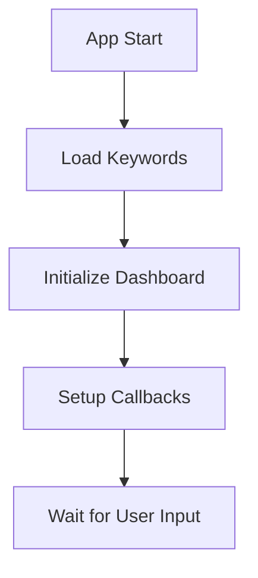
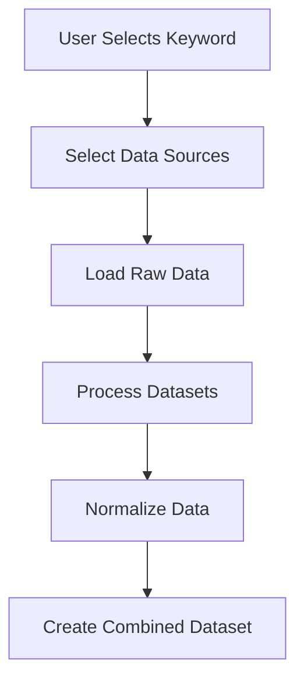
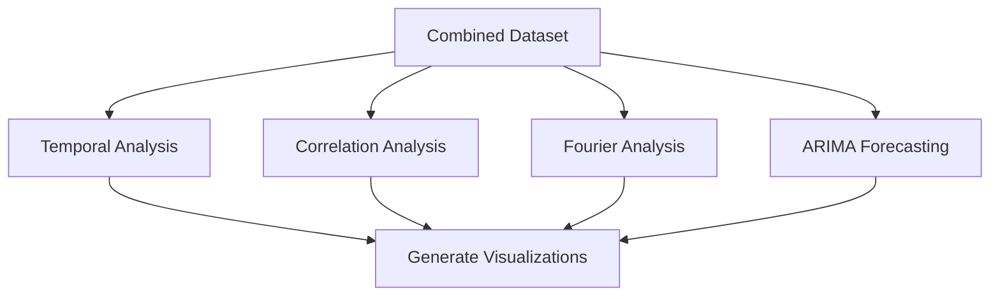
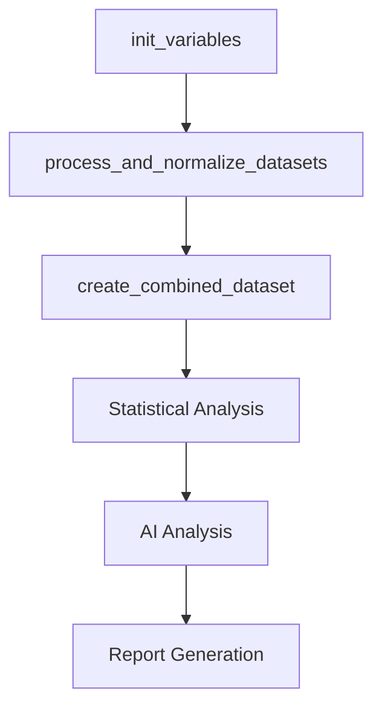
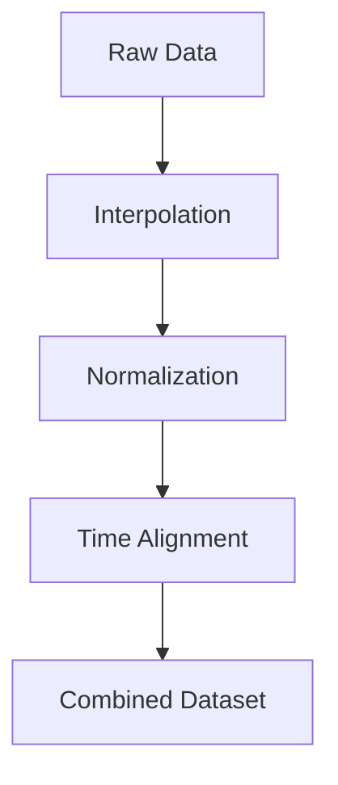

# Function Analysis (Updated)

## Overview

This document analyzes the functions implemented in dashboard.py and analisis.py, showing how they interact and their roles in the application flow.

## Core Function Groups

### 1. Data Source Management

```python
# Data Source Selection and Mapping
def get_all_keywords():
    """Returns list of all available management tool keywords"""
    # Used by: Dashboard dropdown initialization
    # Dependencies: tool_file_dic

def select_multiple_data_sources():
    """Interactive selection of data sources"""
    # Used by: Main analysis flow
    # Returns: List of selected source IDs

def get_filenames_for_keyword(keyword, selected_sources):
    """Maps keywords to source-specific filenames"""
    # Used by: Data loading process
    # Returns: Dict[source_id, filename]
```

### 2. Data Processing Pipeline

```python
# Core Data Processing Chain
def process_and_normalize_datasets(allKeywords):
    """Main data processing orchestrator"""
    # Flow:
    # 1. Keyword selection
    # 2. Source selection
    # 3. Data loading
    # 4. Normalization
    # Returns: (normalized_datasets, selected_sources)

def process_dataset(df, source, all_datasets, selected_sources):
    """Individual dataset processing"""
    # Operations:
    # - Date range alignment
    # - Resampling
    # - Data validation
    # Returns: Processed DataFrame

def normalize_dataset(df):
    """Scales data to 0-100 range"""
    # Used by: process_and_normalize_datasets
    # Returns: Normalized DataFrame
```

### 3. Analysis Functions

```python
# Statistical Analysis Chain
def create_fourier_analysis(data, source_column):
    """Performs Fourier analysis for cyclical patterns"""
    # Dependencies: scipy.fft
    # Returns: Plotly figure

def create_seasonal_decomposition(data, source_column):
    """Decomposes time series into seasonal components"""
    # Dependencies: statsmodels
    # Returns: Plotly figure

def create_arima_forecast(data, source_column):
    """Generates ARIMA forecasts"""
    # Dependencies: pmdarima, statsmodels
    # Returns: Forecast results and figure
```

### 4. Visualization Functions

```python
# Dashboard Visualization Components
def create_line_plot(data, sources):
    """Creates main time series visualization"""
    # Used by: Dashboard callbacks
    # Returns: Plotly figure

def create_correlation_heatmap(data):
    """Generates correlation analysis visualization"""
    # Used by: Dashboard callbacks
    # Returns: Plotly figure

def create_forecast_plot(forecast_results):
    """Visualizes forecast results"""
    # Used by: Dashboard callbacks
    # Returns: Plotly figure
```

## Application Flow

### 1. Initialization Flow



### 2. Data Processing Flow



### 3. Analysis Flow



## Key Function Dependencies

1. **Data Loading Chain**

   get_all_keywords()
   └── get_filenames_for_keyword()
   └── process_dataset()
   └── normalize_dataset()

2. **Analysis Chain**

   process_and_normalize_datasets()
   └── create_combined_dataset()
   ├── create_fourier_analysis()
   ├── create_seasonal_decomposition()
   └── create_arima_forecast()

3. **Visualization Chain**

   Dashboard Callbacks
   ├── create_line_plot()
   ├── create_correlation_heatmap()
   └── create_forecast_plot()

## Callback Structure

### 1. Input Callbacks

```python
# Keyword Selection
@app.callback(
    Output('keyword-validation', 'children'),
    Input('keyword-dropdown', 'value')
)

# Source Selection
@app.callback(
    [Output(f"toggle-source-{id}", "outline") for id in dbase_options.keys()],
    Input("select-all-button", "n_clicks")
)
```

### 2. Analysis Callbacks

```python
# Main Analysis Updates
@app.callback(
    [Output('line-plot', 'figure'),
     Output('correlation-heatmap', 'figure'),
     Output('forecast-plot', 'figure')],
    [Input('keyword-dropdown', 'value'),
     Input('source-selection', 'value')]
)
```

## Error Handling

1. **Data Validation**

   - Input validation in process_dataset()
   - Source availability checks
   - Date range validation

2. **Analysis Safety**

   - Try-except blocks in analysis functions
   - Fallback visualizations for errors
   - Data sufficiency checks

3. **UI Feedback**
   - Loading states
   - Error messages
   - Validation feedback

## Performance Considerations

1. **Data Processing**

   - Efficient data structures (pandas DataFrame)
   - Vectorized operations
   - Caching of intermediate results

2. **Visualization**

   - Lazy loading of plots
   - Efficient update patterns
   - Browser memory management

3. **Analysis**
   - Optimized statistical computations
   - Parallel processing where applicable
   - Resource usage monitoring

## Data Processing Functions

### 1. Interpolation Functions

```python
def linear_interpolation(df, kw):
    """Performs linear interpolation on time series data"""
    # Used for: Filling gaps in time series
    # Returns: DataFrame with interpolated monthly values

def cubic_interpolation(df, kw):
    """Performs cubic spline interpolation"""
    # Used for: Smooth interpolation of sparse data
    # Returns: DataFrame with cubic interpolated values

def bspline_interpolation(df, kw):
    """Performs B-spline interpolation"""
    # Used for: Complex curve fitting
    # Dependencies: scipy.interpolate
    # Returns: DataFrame with B-spline interpolated values
```

### 2. Data Formatting Functions

```python
def eng_notation(number):
    """Converts numbers to engineering notation"""
    # Used for: Display formatting
    # Returns: String in engineering notation

def eng_format(x):
    """Alternative engineering format"""
    # Used for: Display formatting
    # Returns: Formatted string with E notation
```

### 3. File Management Functions

```python
def get_unique_filename(base_filename, unique_folder):
    """Generates unique filenames for outputs"""
    # Used for: Report generation
    # Returns: Non-conflicting filename

def banner_msg(title="", color1=WHITE, color2=WHITE, margin=12, char='*'):
    """Creates formatted console output"""
    # Used for: CLI interface
    # Returns: Formatted string with colors
```

## Analysis Functions

### 1. AI Integration

```python
def gemini_prompt(system_prompt, prompt, m='flash'):
    """Handles AI model interactions"""
    # Dependencies: google.generativeai
    # Used for: Analysis interpretation
    # Returns: AI-generated analysis text
```

### 2. Data Source Processing

```python
def get_file_data2(selected_keyword, selected_sources):
    """Main data loading and processing function"""
    # Flow:
    # 1. Get filenames for keyword
    # 2. Load data for each source
    # 3. Process and normalize data
    # Returns: (normalized_datasets, selected_sources)
```

## Global Variables and Constants

```python
# Color Constants
RESET = '\033[0m'
RED = '\033[31m'
GREEN = '\033[32m'
YELLOW = '\033[33m'
BLUE = '\033[34m'
MAGENTA = '\033[35m'
CYAN = '\033[36m'
WHITE = '\033[37m'
GRAY = '\033[30m'

# Analysis State Variables
global_variables = {
    'gem_temporal_trends_sp': None,  # Temporal analysis results
    'gem_cross_keyword_sp': None,    # Cross-keyword analysis
    'gem_industry_specific_sp': None, # Industry analysis
    'gem_arima_sp': None,            # ARIMA analysis results
    'gem_seasonal_sp': None,         # Seasonal analysis
    'gem_fourier_sp': None,          # Fourier analysis
    'gem_conclusions_sp': None,      # Analysis conclusions
    'csv_fourier': [],               # Fourier analysis data
    'csv_means_trends': [],          # Trend means data
    'csv_correlation': [],           # Correlation data
    'csv_regression': [],            # Regression analysis
    'csv_arima': [],                 # ARIMA model data
    'csv_seasonal': []               # Seasonal decomposition data
}
```

## Data Flow Patterns

### 1. Main Analysis Flow



### 2. Data Processing Chain



## Key Implementation Details

### 1. Data Preprocessing

- Multiple interpolation methods available (linear, cubic, B-spline)
- Automatic handling of missing values
- Time series alignment across sources
- Data normalization and standardization

### 2. Analysis Pipeline

- Temporal trend analysis
- Cross-source correlation
- Fourier analysis for cyclical patterns
- ARIMA modeling for forecasting
- Seasonal decomposition
- AI-assisted interpretation

### 3. Output Generation

- CSV data export
- Visualization generation
- Report compilation
- Console feedback

## Error Handling Strategy

### 1. Data Validation

```python
# Example validation pattern
try:
    df.index = pd.to_datetime(df.index).tz_localize(None)
    earliest_date = max(df.index.min() for df in all_datasets.values())
    latest_date = min(df.index.max() for df in all_datasets.values())
except Exception as e:
    print(f"Error in data validation: {str(e)}")
```

### 2. Processing Safety

- Null checking before operations
- Type validation for inputs
- Date range verification
- Source availability confirmation

### 3. Output Verification

- Data consistency checks
- Result validation
- Format verification
- Resource cleanup

## Performance Optimizations

### 1. Data Handling

- Efficient DataFrame operations
- Vectorized calculations
- Memory-conscious processing
- Intermediate result caching

### 2. Analysis Efficiency

- Optimized statistical computations
- Selective data loading
- Resource monitoring
- Process isolation where needed
