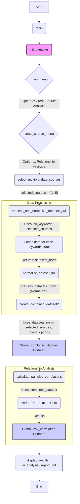

# Option 2

```mermaid
flowchart TB
    Start --> A(main)
    A --> B(init_variables)
    B --> C{main_menu}
    C -- Option 2: Cross-Source Analysis --> D{cross_source_menu}
    D -- Option 1: Relationship Analysis --> E(select_multiple_data_sources)
    E -- selected_sources = [All 5] --> F(process_and_normalize_datasets_full)
    subgraph "Data Processing"
    direction LR
        F -- Uses: all_keywords, selected_sources --> G(Loads data for each keyword/source)
        G -- Returns: datasets_norm --> H(normalize_dataset_full)
        H -- Returns: datasets_norm (Normalized) --> I(create_combined_dataset2)
    end
    I -- Uses: datasets_norm, selected_sources, dbase_options --> J[Global: combined_dataset Updated]
    J --> K(calculate_pairwise_correlations)
    subgraph "Relationship Analysis"
    direction LR
        K -- Uses: combined_dataset --> L(Perform Correlation Calc.)
        L -- Results --> M[Global: csv_correlation Updated]
    end
    M --> N(display_results / ai_analysis / report_pdf)
    N --> End

    style B fill:#f9f,stroke:#333,stroke-width:2px
    style E fill:#lightgrey,stroke:#333
    style F fill:#lightgrey,stroke:#333
    style K fill:#lightgrey,stroke:#333
    style N fill:#lightgrey,stroke:#333
    style J fill:#ccf,stroke:#333,stroke-width:2px
    style M fill:#ccf,stroke:#333,stroke-width:2px
```
