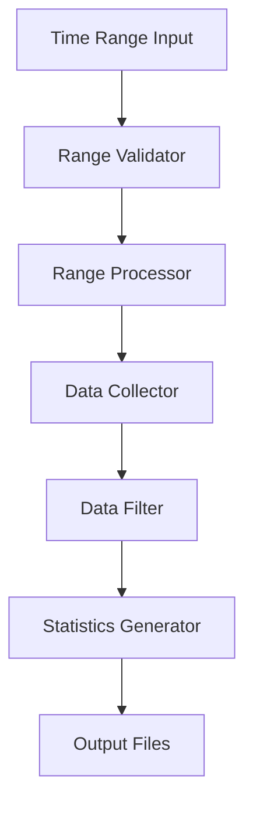
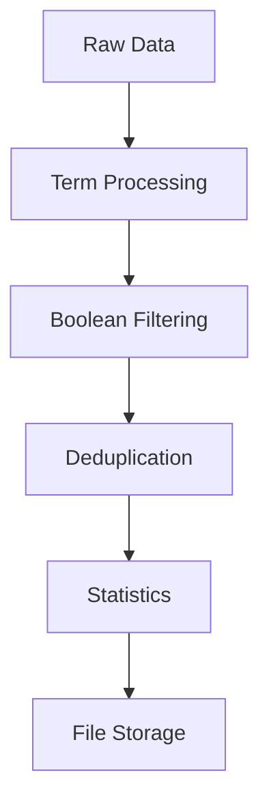
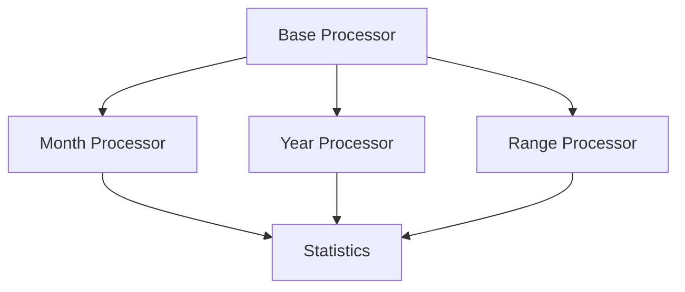

# System Patterns

## Architecture Overview

### Core Application Components

1. **Analysis Engine (correlation.py)**

   - Time Series Analysis
     - ARIMA modeling
     - Fourier analysis
     - Seasonal decomposition
     - Trend detection
   - Statistical Processing
     - Correlation analysis
     - Regression modeling
     - Pattern recognition
     - Data interpolation
   - Data Integration
     - Multi-source processing
     - Data normalization
     - Cross-validation
     - Quality control

2. **Interactive Dashboard (dashboard.py)**
   - Data Visualization
     - Real-time charts
     - Interactive filters
     - Cross-source comparisons
   - User Interface
     - Responsive design
     - Dynamic controls
     - Export options
   - State Management
     - Data caching
     - Session handling
     - Update propagation

### Data Processing Pipeline

1. Input Layer

   - Single month processing (YY-MM)
   - Full year processing (YYYY)
   - Multi-year processing (YYYY-YYYY)
   - Command line and interactive interfaces

2. Processing Layer

   - Term-based data collection
   - Boolean query filtering
   - Duplicate detection
   - Statistics generation

3. Output Layer
   - Monthly statistics files
   - Annual statistics files
   - Multi-year statistics files
   - JSON data storage

### Utility Components

1. **crdbase2.py**
   - Year range processing module
   - Enhanced validation system
   - Multi-year statistics generation
   - Optimized storage management
   - Advanced error handling

## Design Patterns

### 1. Command Pattern

- Used for processing different time ranges
- Encapsulates processing logic
- Standardizes data handling
- Enables easy extension

### 2. Strategy Pattern

- Applied to data collection methods
- Supports different time ranges
- Allows algorithm variation
- Maintains consistent interface

### 3. Factory Pattern

- Creates appropriate processors
- Handles different time ranges
- Manages object creation
- Ensures consistency

### 4. Observer Pattern

- Monitors processing progress
- Updates statistics
- Handles notifications
- Manages event flow

## Component Relationships

### 1. Time Range Processing

### 2. Data Flow

### 3. Processing Hierarchy

## Technical Decisions

### 1. Time Range Handling

- Standardized YYYY-YYYY format
- Validation at multiple levels
- Consistent error handling
- Progress tracking

### 2. Data Processing

- Sequential processing
- Memory management
- API rate limiting
- Error recovery

### 3. Output Organization

- Structured file hierarchy
- Consistent naming
- Version control
- Backup strategy

## Best Practices

### 1. Code Organization

- Clear module structure
- Consistent naming
- Documentation
- Error handling

### 2. Data Management

- Validation checks
- Data integrity
- Efficient storage
- Backup procedures

### 3. Performance

- Resource monitoring
- Optimization strategies
- Caching mechanisms
- Memory management

## Future Considerations

### 1. Scalability

- Parallel processing
- Distributed computing
- Load balancing
- Resource allocation

### 2. Maintainability

- Code modularity
- Documentation
- Testing strategy
- Version control

### 3. Extensibility

- Plugin architecture
- API design
- Configuration options
- Custom processors
